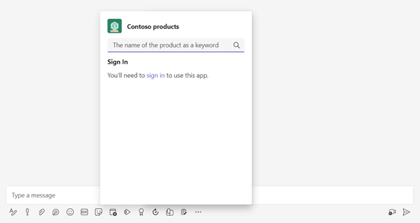
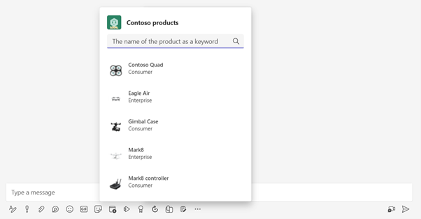
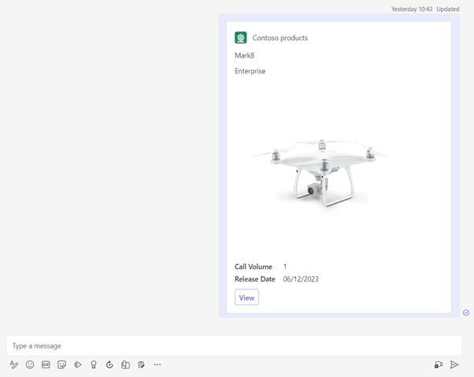
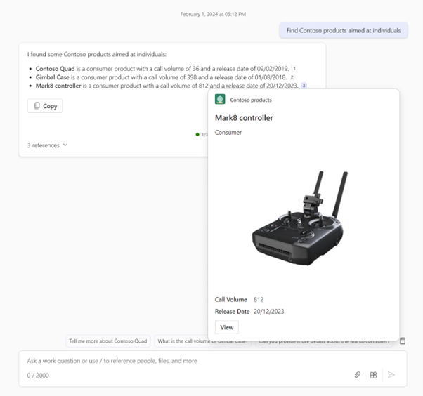

---
lab:
  title: 소개
  module: 'LAB 03: Connect Copilot for Microsoft 365 to your external data in real-time with message extension plugins built with .NET and Visual Studio'
---

# 소개

메시지 확장을 사용하면 사용자가 Microsoft Teams 및 Microsoft Outlook의 외부 시스템을 사용하여 작업할 수 있습니다. 사용자는 메시지 확장을 사용하여 데이터를 조회 및 변경하고 메시지 및 전자 메일에서 이러한 시스템의 정보를 서식 있는 카드로 공유할 수 있습니다.

최신 상태이며 조직과 관련된 제품 정보가 포함된 SharePoint Online 목록이 있다고 가정해 보겠습니다. Microsoft 365에서 이 정보를 검색하고 공유하려고 합니다. 또한 Microsoft 365용 Copilot에서 이 정보를 답변에 사용하려고 합니다.

이 랩에서는 메시지 확장을 만듭니다. 메시지 확장은 봇을 사용하여 Microsoft Teams, Microsoft Outlook 및 Microsoft 365용 Copilot과 통신합니다.

Microsoft Entra를 통해 사용자를 인증하여 사용자 대신 Microsoft Graph API를 사용하여 SharePoint Online에서 데이터를 반환할 수 있습니다.

사용자가 인증하면 메시지 확장은 Microsoft Graph API를 사용하여 SharePoint Online에서 제품 정보를 가져옵니다. 메시지와 전자 메일에 서식 있는 카드로 포함할 수 있는 검색 결과를 반환한 다음 공유합니다.

Microsoft 365용 Copilot을 플러그 인으로 사용하여 사용자 대신 SharePoint Online 목록을 쿼리하고 반환된 데이터를 답변에 사용할 수 있습니다.

이 랩을 마치면 C#(.NET에서 실행)으로 작성된 메시지 확장을 만들 수 있습니다. Microsoft Teams, Microsoft Outlook 및 Microsoft 365용 Copilot에서 사용할 수 있습니다. 보호된 API 뒤에 있는 데이터를 쿼리하고 결과를 서식 있는 카드로 반환할 수 있습니다.

## 필수 조건

- C#에 대한 기본 지식
- Bicep에 대한 기본 지식
- 인증에 대한 기본 지식
- Microsoft 365 테넌트에 대한 관리자 액세스
- Azure 구독에 대한 액세스
- Microsoft 365용 Copilot에 대한 액세스는 선택 사항이며 하나의 연습을 완료하는 데만 필요합니다.
- [Teams 도구 키트](/microsoftteams/platform/toolkit/toolkit-v4/teams-toolkit-fundamentals-vs)(Microsoft Teams 개발 도구 구성 요소)가 설치된 Visual Studio 2022 17.9
- [.NET 8.0](https://dotnet.microsoft.com/download/dotnet/8.0)

시작 준비가 되면 [다음 연습을 계속 진행합니다...](./2-exercise-create-a-message-extension.md)
