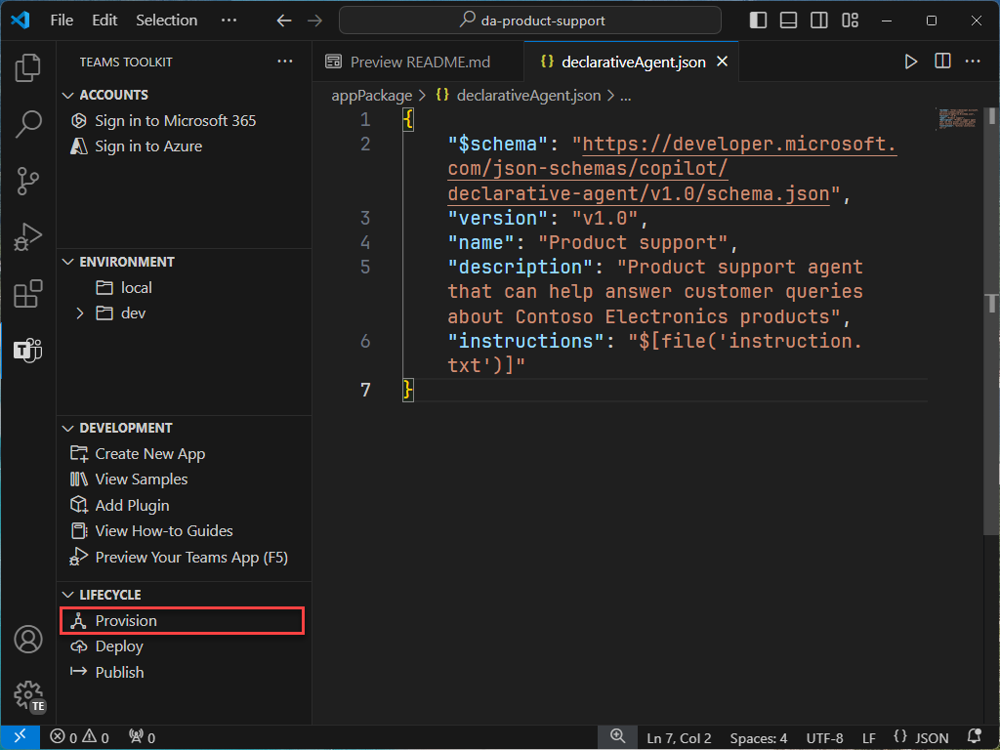
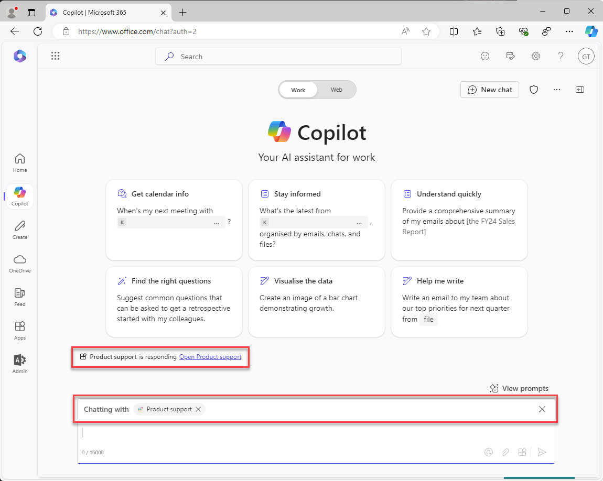
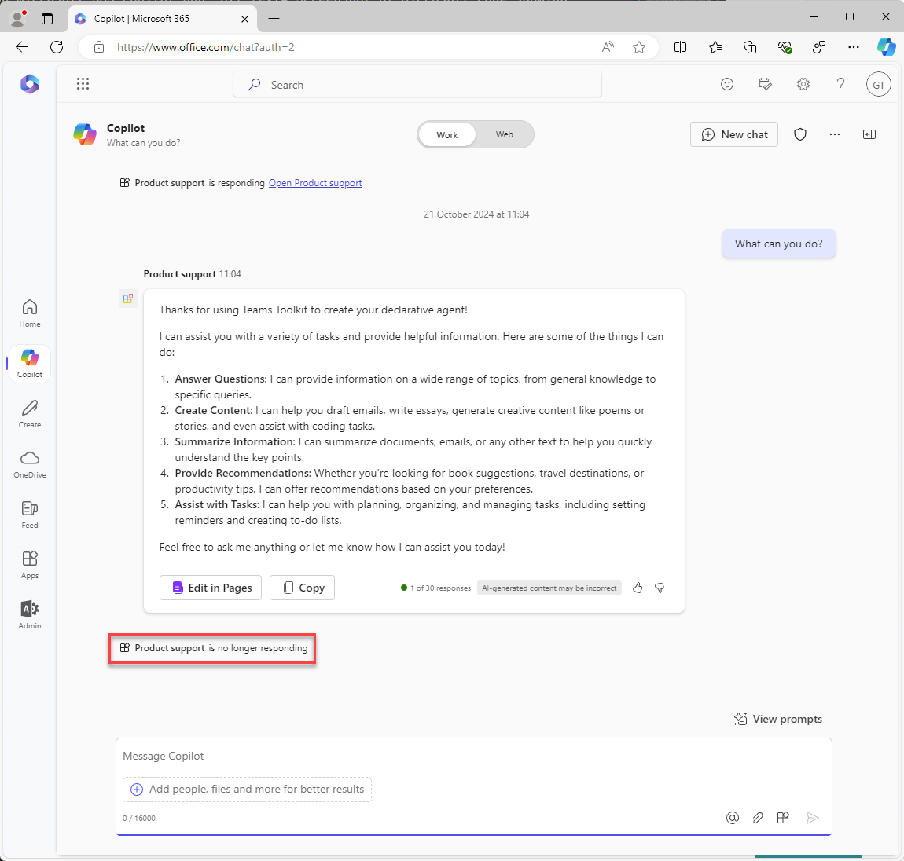

---
lab:
  title: 연습 1 - Visual Studio Code에서 선언적 에이전트 만들기
  module: 'LAB 01: Build a declarative agent for Microsoft 365 Copilot using Visual Studio Code'
---

# 연습 1 - 선언적 에이전트 만들기

이 연습에서는 템플릿에서 선언적 에이전트 프로젝트를 만들고, 매니페스트를 업데이트하고, Microsoft 365에 에이전트를 업로드하고, Microsoft 365 Copilot에서 에이전트를 테스트합니다. 

선언적 에이전트는 Microsoft 365 앱에서 구현됩니다. 다음을 포함하는 앱 패키지를 만듭니다.

- app.manifest.json: 앱 매니페스트 파일은 해당 기능을 포함하여 앱이 구성되는 방법을 설명합니다.
- declarative-agent.json: 선언적 에이전트 매니페스트는 선언적 에이전트가 구성 방법을 설명합니다.
- color.png 및 outline.png: Microsoft 365 Copilot 사용자 인터페이스에서 선언적 에이전트를 나타내는 데 사용되는 색 및 윤곽선 아이콘입니다.

### 연습 기간

- **예상 완료 시간**:15분

## 작업 1 - 시작 프로젝트 다운로드

먼저 웹 브라우저의 GitHub에서 샘플 프로젝트를 다운로드합니다.

1. [https://github.com/microsoft/learn-declarative-agent-vscode](https://github.com/microsoft/learn-declarative-agent-vscode) 템플릿 리포지토리로 이동합니다.
    1. 단계에 따라 [리포지토리 소스 코드를 컴퓨터에 다운로드](https://docs.github.com/repositories/working-with-files/using-files/downloading-source-code-archives#downloading-source-code-archives-from-the-repository-view)합니다.
    1. 다운로드한 ZIP 파일 내용물의 압축을 풀고 **문서 폴더**에 압축을 풉니다.

시작 프로젝트에는 선언적 에이전트를 포함하는 Teams 도구 키트 프로젝트가 포함되어 있습니다.

1. Visual Studio Code에서  프로젝트 폴더를 엽니다.
1. 프로젝트 루트 폴더에서 **README.md** 파일을 엽니다. 프로젝트 구조에 대한 자세한 내용은 내용을 검토합니다.


## 작업 2 - 선언적 에이전트 매니페스트 검사

선언적 에이전트 매니페스트 파일을 살펴보겠습니다.

- **appPackage/declarativeAgent.json** 파일을 열고 내용을 검사합니다.

    ```json
    {
        "$schema": "https://aka.ms/json-schemas/agent/declarative-agent/v1.0/schema.json",
        "version": "v1.0",
        "name": "da-product-support",
        "description": "Declarative agent created with Teams Toolkit",
        "instructions": "$[file('instruction.txt')]"
    }
    ```

**instruction** 속성 값에는 **instruction.txt**라는 파일에 대한 참조가 포함되어 있습니다. **$[file(path)]** 함수는 Teams 도구 키트에서 제공합니다. Microsoft 365에 프로비저닝할 때 선언적 에이전트 매니페스트 파일에 **instruction.txt**의 콘텐츠가 포함됩니다.

- **appPackage** 폴더에서 **instruction.txt** 파일을 열고 내용을 검토합니다.

    ```md
    You are a declarative agent and were created with Team Toolkit. You should start every response and answer to the user with "Thanks for using Teams Toolkit to create your declarative agent!\n\n" and then answer the questions and help the user.
    ```

## 작업 3 - 선언적 에이전트 매니페스트 업데이트

**name** 및 **description** 속성을 시나리오와 더 연관성이 있도록 업데이트해 보겠습니다.

1. **appPackage** 폴더에서 **declarativeAgent.json** 파일을 엽니다.
1. **name** 속성 값을 **Product support**로 업데이트합니다.
1. **description** 속성 값을 **Product support agent that can help answer customer queries about Contoso Electronics products**로 업데이트합니다.
1. 변경 내용을 저장합니다.

업데이트된 파일에는 다음과 같은 내용이 포함되어야 합니다.

```json
{
    "$schema": "https://aka.ms/json-schemas/agent/declarative-agent/v1.0/schema.json",
    "version": "v1.0",
    "name": "Product support",
    "description": "Product support agent that can help answer customer queries about Contoso Electronics products",
    "instructions": "$[file('instruction.txt')]"
}
```

## 작업 4 - Microsoft 365에 선언적 에이전트 업로드

> [!IMPORTANT]
> 시작하기 전에 Visual Studio Code에 Teams 도구 키트 확장이 설치되어 있는지 확인합니다. 마켓플레이스에서 확장을 아직 설치하지 않은 경우 지금 설치합니다.

다음으로, 선언적 에이전트를 Microsoft 365 테넌트에 업로드합니다.

Visual Studio Code:

1. **작업 표시줄**에서 **Teams 도구 키트** 확장을 엽니다.

    

1. **수명 주기** 섹션에서 **프로비전**을 선택합니다.

    

1. 프롬프트에서 **로그인**을 선택하고 프롬프트에 따라 Teams 도구 키트를 사용하여 Microsoft 365 테넌트에 로그인합니다. 프로비전 프로세스는 로그인한 후 자동으로 시작됩니다.

    

    

1. 계속하기 전에 업로드가 완료될 때까지 기다립니다.

    

다음으로 프로비전 프로세스의 출력을 검토합니다.

- **appPackage/build** 폴더에서 **declarativeAgent.dev.json** 파일을 엽니다.

**instruction** 속성 값에 **instruction.txt** 파일의 내용이 포함되어 있음을 알 수 있습니다. **declarativeAgent.dev.json** 파일은 **appPackage.dev.zip** 파일에 **manifest.dev.json**, **color.png**, **outline.png** 파일과 함께 포함되어 있습니다. **appPackage.dev.zip** 파일이 Microsoft 365에 업로드됩니다.

## 작업 5 - Microsoft 365 Copilot에서 선언적 에이전트 테스트

다음으로 Microsoft 365 Copilot에서 선언적 에이전트를 실행하고 **컨텍스트** 및 **몰입형** 환경 모두에서 기능의 유효성을 검사해 보겠습니다.

Visual Studio Code:

1. **작업 표시줄**에서 **실행 및 디버그** 보기로 전환합니다.

    

1. 구성의 드롭다운 옆에 있는 **디버깅 시작** 버튼을 선택하거나 <kbd>F5</kbd> 키를 누릅니다. 새 브라우저 창이 시작되고 Microsoft 365 Copilot으로 이동합니다.

    

    

    

브라우저에서 계속하여 **컨텍스트** 환경을 테스트해 보겠습니다.

1. **Microsoft 365 Copilot**에서 메시지 상자에 <kbd>@</kbd> 기호를 입력합니다. 플라이아웃은 사용 가능한 에이전트 목록과 함께 표시됩니다.

    

1. 플라이아웃에서 **제품 지원**를 선택합니다. 메시지 상자 위의 상태 메시지를 확인합니다. **제품 고객 지원팀과 채팅 중**이 표시되며, 이는 에이전트의 상황에 맞는 환경을 사용하고 있음을 의미합니다.

    

1. 텍스트 상자에 **What can you do?** 를 입력하고 메시지를 제출합니다.

    

1. 응답을 기다. 응답이 텍스트 "Teams 도구 키트를 사용하여 선언적 에이전트를 만들어 주셔서 감사합니다!"로 시작하는 방법을 확인합니다. 앞에서 검토한 지침에 정의된 대로

    

1. 상황에 맞는 환경을 종료하려면 상태 메시지에서 X표를 선택합니다. 상태 메시지가 제거되고 더 이상 에이전트와 채팅하지 않음을 나타내는 메시지가 채팅 창에 표시됩니다.

    

    

마지막으로 **몰입형** 환경을 테스트해 보겠습니다.

브라우저에서 계속합니다.

1. **Microsoft 365 Copilot**에서 오른쪽 상단의 아이콘을 선택하여 Copilot 가로 패널을 확장합니다. 패널에 최근 채팅 및 사용 가능한 에이전트가 표시됩니다.

    

1. 가로 패널에서 **제품 지원**을 선택하여 몰입형 환경으로 들어가 에이전트와 직접 채팅할 수 있습니다. 인터페이스에 두 개의 샘플 프롬프트가 표시됩니다.

    

1. **자세한 정보**라는 제목의 샘플 프롬프트를 선택합니다. 메시지 상자에 **What can you do?** 라는 텍스트가 추가되는 것을 확인할 수 있습니다.

    

1. 메시지를 보내고 응답을 기다립니다. 응답이 텍스트 "Teams 도구 키트를 사용하여 선언적 에이전트를 만들어 주셔서 감사합니다!"로 시작하는 방법을 확인합니다. 앞에서 검토한 지침에 정의된 대로

    

마지막으로 브라우저를 닫아 Visual Studio Code에서 디버그 세션을 중지합니다.