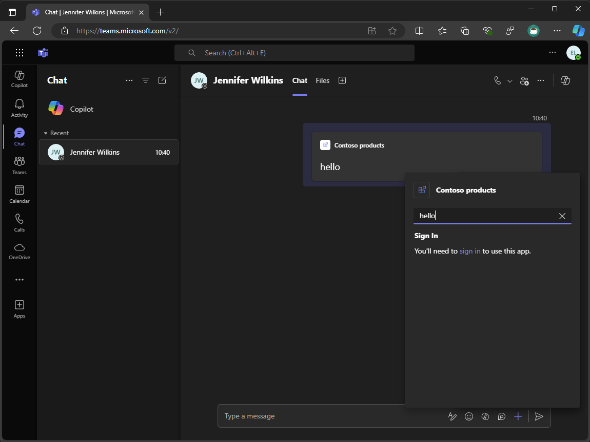
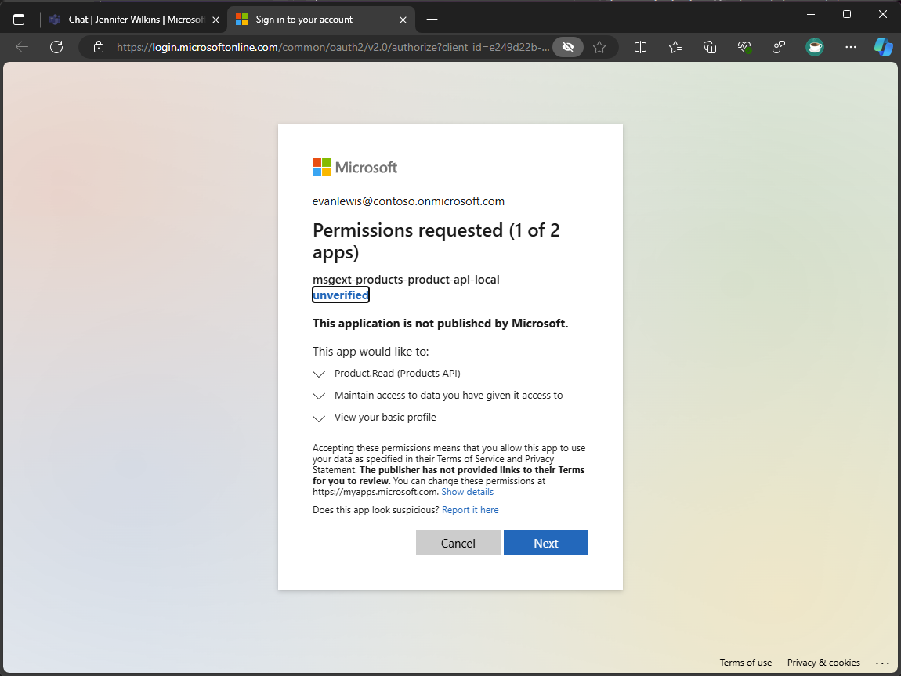

---
lab:
  title: 연습 2 - Single Sign-On 추가
  module: 'LAB 01: Connect Microsoft 365 Copilot to your external data in real-time with message extension plugins built with .NET and Visual Studio'
---

# 연습 2 - Single Sign-On 추가

이 연습에서는 메시지 확장에 Single Sign-On을 추가하여 사용자 쿼리를 인증합니다.



### 연습 기간

  - **예상 완료 시간**: 40분

## 작업 1 - 백엔드 API 앱 등록 구성

먼저 백엔드 API에 대한 Microsoft Entra 앱 등록을 만듭니다. 이 연습에서는 새 항목을 만들 수 있지만 프로덕션 환경에서는 기존 앱 등록을 사용합니다.

브라우저 창을 엽니다.

1. [Azure Portal](https://portal.azure.com)로 이동합니다.

1. 포털 메뉴를 연 다음 **Microsoft Entra ID**를 선택합니다.

1. **관리 > 앱 등록**을 선택한 다음, **새 등록**을 선택합니다.

1. 애플리케이션 등록 양식에서 다음 값을 지정합니다.

    1. **이름**: 제품 API

    1. **지원되는 계정 유형**: 모든 조직 디렉터리(모든 Microsoft Entra ID - 다중 테넌트)의 계정을 선택합니다.

1. **등록**을 선택하여 앱 등록을 만듭니다.

1. 앱 등록 왼쪽 메뉴에서 **Manage > Expose an API**를 선택합니다.

1. **애플리케이션 ID URI** 옆에 있는 **추가** 및 **저장**을 선택하여 새 애플리케이션 ID URI를 만듭니다.

1. 이 API 섹션에서 정의한 범위에서 **범위 추가**를 선택합니다.

1. 범위 추가 양식에서 다음 값을 지정합니다.

    1. **범위 이름**: 제품 읽기

    1. **동의할 수 있는 사람은 누구인가요?**: 관리자 및 사용자

    1. **관리자 동의 표시 이름**: 제품 읽기

    1. **관리자 동의 설명**: 앱에서 제품 데이터를 읽을 수 있도록 허용

    1. **사용자 동의 표시 이름**: 제품 읽기

    1. **사용자 동의 설명**: 앱에서 제품 데이터를 읽을 수 있도록 허용

    1. **상태**: 사용됨

1. **범위 추가**를 선택하여 범위를 만듭니다.

다음으로 앱 등록 ID 및 범위 ID를 기록해 둡니다. 백엔드 API에 대한 액세스 토큰을 가져오는 데 사용되는 앱 등록을 구성하려면 이러한 값이 필요합니다.

1. 앱 등록 왼쪽 메뉴에서 **매니페스트**를 선택합니다.

1. **appId** 속성 값을 복사하여 나중에 사용할 수 있도록 저장해 둡니다.

1. **oauth2Permissions.id** 속성 값을 복사하여 나중에 사용할 수 있도록 저장해 둡니다.

프로젝트에서 이러한 값이 필요하므로 환경 파일에 추가합니다.

Visual Studio 및 **TeamsApp** 프로젝트에서 다음을 수행합니다.

1. **env** 폴더에서 **.env.local**을 엽니다

1. 파일에서 다음 환경 변수를 추가하고 이전에 저장한 **앱 등록 ID** 및 **범위 ID**로 값을 설정합니다.

    ```text
    BACKEND_API_ENTRA_APP_ID=<app-registration-id>
    BACKEND_API_ENTRA_APP_SCOPE_ID=<scope-id>
    ```

1. 변경 내용을 저장합니다.

## 작업 2 - 백엔드 API를 사용하여 인증을 위한 앱 등록 매니페스트 파일 만들기

백엔드 API를 사용하여 인증하려면 앱 등록을 통해 API를 호출할 액세스 토큰을 가져와야 합니다.

다음으로, 앱 등록 매니페스트 파일을 만듭니다. 매니페스트는 앱 등록에 대한 API 권한 범위 및 리디렉션 URI를 정의합니다.

Visual Studio 및 **TeamsApp** 프로젝트에서 다음을 수행합니다.

1. **infra\entra** 폴더에서 **entra.products.api.manifest.json**이라는 이름의 새 파일을 만듭니다(<kbd>Ctrl+Shift+A</kbd>).

1.  파일에서 다음 코드를 추가합니다.

    ```json
    {
      "id": "${{PRODUCTS_API_ENTRA_APP_OBJECT_ID}}",
      "appId": "${{PRODUCTS_API_ENTRA_APP_ID}}",
      "name": "${{APP_INTERNAL_NAME}}-product-api-${{TEAMSFX_ENV}}",
      "accessTokenAcceptedVersion": 2,
      "signInAudience": "AzureADMultipleOrgs",
      "optionalClaims": {
        "idToken": [],
        "accessToken": [
          {
            "name": "idtyp",
            "source": null,
            "essential": false,
            "additionalProperties": []
          }
        ],
        "saml2Token": []
      },
      "requiredResourceAccess": [
        {
          "resourceAppId": "${{BACKEND_API_ENTRA_APP_ID}}",
          "resourceAccess": [
            {
              "id": "${{BACKEND_API_ENTRA_APP_SCOPE_ID}}",
              "type": "Scope"
            }
          ]
        }
      ],
      "oauth2Permissions": [],
      "preAuthorizedApplications": [],
      "identifierUris": [],
      "replyUrlsWithType": [
        {
          "url": "https://token.botframework.com/.auth/web/redirect",
          "type": "Web"
        }
      ]
    }
    ```

1. 변경 내용을 저장합니다.

**requiredResourceAccess** 속성은 백엔드 API의 앱 등록 ID 및 범위 ID를 지정합니다.

**replyUrlsWithType** 속성은 사용자가 인증한 후 액세스 토큰을 토큰 서비스에 반환하기 위해 Bot Framework 토큰 서비스에서 사용하는 리디렉션 URI를 지정합니다.

다음으로, 자동화된 워크플로를 업데이트하여 앱 등록을 만들고 업데이트합니다.

**TeamsApp** 프로젝트에서 다음을 수행합니다.

1. **teamsapp.local.yml**을 엽니다.

1. 파일에서 **aadApp/update** 작업을 사용하는 단계를 찾습니다.

1. 작업 후에 **aadApp/create** 및 **aadApp/update** 작업을 추가하여 앱 등록을 만들고 업데이트합니다(**31줄**부터 시작).

    ```yml
      - uses: aadApp/create
        with:
            name: ${{APP_INTERNAL_NAME}}-products-api-${{TEAMSFX_ENV}}
            generateClientSecret: true
            signInAudience: AzureADMultipleOrgs
        writeToEnvironmentFile:
            clientId: PRODUCTS_API_ENTRA_APP_ID
            clientSecret: SECRET_PRODUCTS_API_ENTRA_APP_CLIENT_SECRET
            objectId: PRODUCTS_API_ENTRA_APP_OBJECT_ID
            tenantId: PRODUCTS_API_ENTRA_APP_TENANT_ID
            authority: PRODUCTS_API_ENTRA_APP_OAUTH_AUTHORITY
            authorityHost: PRODUCTS_API_ENTRA_APP_OAUTH_AUTHORITY_HOST
    
      - uses: aadApp/update
        with:
            manifestPath: "./infra/entra/entra.products.api.manifest.json"
            outputFilePath : "./infra/entra/build/entra.products.api.${{TEAMSFX_ENV}}.json"
    ```

1. 변경 내용을 저장합니다.

**aadApp/create** 작업은 지정된 이름, 대상 그룹을 사용하여 새 앱 등록을 만들고 클라이언트 암호를 생성합니다. **writeToEnvironmentFile** 속성은 앱 등록 ID, 클라이언트 암호, 개체 ID, 테넌트 ID, 기관 및 기관 호스트를 환경 파일에 씁니다. 클라이언트 암호는 암호화되어 **env.local.user** 파일에 안전하게 저장됩니다. 클라이언트 암호의 환경 변수 이름 앞에는 **SECRET_** 가 접두사로 지정되며, Teams 도구 키트에서 로그에 값을 쓰지 않도록 지시합니다.

**aadApp/update** 작업은 지정된 매니페스트 파일로 앱 등록을 업데이트합니다.

## 작업 3 - 연결 설정 이름 중앙 집중화

다음으로, 환경 파일에서 연결 설정 이름을 중앙 집중화하고 앱 구성을 업데이트하여 런타임에 환경 변수에 액세스합니다.

Visual Studio 및 **TeamsApp** 프로젝트에서 계속 진행합니다.

1. **env** 폴더에서 **.env.local**을 엽니다

1.  파일에서 다음 코드를 추가합니다.

    ```text
    CONNECTION_NAME=ProductsAPI
    ```

1. **teamsapp.local.yml**을 엽니다.

1. 파일에서 **./appsettings.Development.json** 파일을 대상으로 하는 **file/createOrUpdateJsonFile** 작업을 사용하는 단계를 찾습니다. **CONNECTION_NAME** 환경 변수를 포함하도록 콘텐츠 배열을 업데이트하고 이 값을 **appsettings.Development.json**파일에 씁니다.

    ```yml
      - uses: file/createOrUpdateJsonFile
        with:
          target: ../ProductsPlugin/appsettings.Development.json
          content:
            BOT_ID: ${{BOT_ID}}
            BOT_PASSWORD: ${{SECRET_BOT_PASSWORD}}
            CONNECTION_NAME: ${{CONNECTION_NAME}}
    ```

1. 변경 내용을 저장합니다.

다음으로, **CONNECTION_NAME** 환경 변수에 액세스하도록 앱 구성을 업데이트합니다.

**ProductsPlugin** 프로젝트에서 다음을 수행합니다.

1. **Config.cs**를 엽니다.

1. **ConfigOptions** 클래스에서 이름이 **CONNECTION_NAME**인 새 속성을 추가합니다.

    ```csharp
    public class ConfigOptions
    {
      public string BOT_ID { get; set; }
      public string BOT_PASSWORD { get; set; }
      public string CONNECTION_NAME { get; set; }
    }
    ```

1. 변경 내용을 저장합니다.

1. **Program.cs**를 엽니다.

1. 파일에서 앱 구성을 읽는 코드를 업데이트하여 **CONNECTION_NAME** 속성을 포함합니다.

    ```csharp
    var config = builder.Configuration.Get<ConfigOptions>();
    builder.Configuration["MicrosoftAppType"] = "MultiTenant";
    builder.Configuration["MicrosoftAppId"] = config.BOT_ID;
    builder.Configuration["MicrosoftAppPassword"] = config.BOT_PASSWORD;
    builder.Configuration["ConnectionName"] = config.CONNECTION_NAME;
    ```

1. 변경 내용을 저장합니다.

다음으로, 런타임에 연결 설정 이름을 사용하도록 봇 코드를 업데이트합니다.

1. **검색** 폴더에서 **SearchApp.cs**를 엽니다.

1. **SearchApp** 클래스의 시작 부분(약 14줄)에서 **IConfiguration** 개체를 수락하고 **CONNECTION_NAME** 속성 값을 **connectionName**이라는 프라이빗 필드에 할당하는 생성자를 만듭니다.

    ```csharp
    private readonly string connectionName;
    public SearchApp(IConfiguration configuration)
    {
      connectionName = configuration["CONNECTION_NAME"];
    }  
    ```

1. 변경 내용을 저장합니다.

## 작업 4 - 제품 API 연결 설정 구성

백엔드 API로 인증하려면 Azure Bot 리소스에서 연결 설정을 구성해야 합니다.

Visual Studio 및 **TeamsApp** 프로젝트에서 계속 진행합니다.

1. 인프라 **폴더**에서 이름이 **azure.parameters.local.json**인 파일을 엽니다.

1. 파일에서 **backendApiEntraAppClientId**, **productsApiEntraAppClientId**, **productsApiEntraAppClientSecret** 및 **connectionName** 매개 변수를 추가합니다.

    ```json
    {
      "$schema": "https://schema.management.azure.com/schemas/2015-01-01/deploymentParameters.json#",
      "contentVersion": "1.0.0.0",
      "parameters": {
        "resourceBaseName": {
          "value": "bot-${{RESOURCE_SUFFIX}}-${{TEAMSFX_ENV}}"
        },
        "botEntraAppClientId": {
          "value": "${{BOT_ID}}"
        },
        "botDisplayName": {
          "value": "${{APP_DISPLAY_NAME}}"
        },
        "botAppDomain": {
          "value": "${{BOT_DOMAIN}}"
        },
        "backendApiEntraAppClientId": {
          "value": "${{BACKEND_API_ENTRA_APP_ID}}"
        },
        "productsApiEntraAppClientId": {
          "value": "${{PRODUCTS_API_ENTRA_APP_ID}}"
        },
        "productsApiEntraAppClientSecret": {
          "value": "${{SECRET_PRODUCTS_API_ENTRA_APP_CLIENT_SECRET}}"
        },
        "connectionName": {
          "value": "${{CONNECTION_NAME}}"
        }
      }
    }
    ```

1. 변경 내용을 저장합니다.

다음으로, 새 매개 변수를 포함하도록 Bicep 파일을 업데이트하고 Azure Bot 리소스에 전달합니다.

1. **인프라** 폴더에서 이름이 **azure.local.bicep**인 파일을 엽니다.

1. 파일에서 **botAppDomain** 매개 변수 선언 후에 **backendApiEntraAppClientId**, **productsApiEntraAppClientId**, **productsApiEntraAppClientSecret** 및 **connectionName** 매개 변수 선언을 추가합니다.

    ```bicep
    param backendApiEntraAppClientId string
    param productsApiEntraAppClientId string
    @secure()
    param productsApiEntraAppClientSecret string
    param connectionName string
    ```

1. **azureBotRegistration** 모듈 선언에서 새 매개 변수를 추가합니다.

    ```bicep
    module azureBotRegistration './botRegistration/azurebot.bicep' = {
      name: 'Azure-Bot-registration'
      params: {
        resourceBaseName: resourceBaseName
        botEntraAppClientId: botEntraAppClientId
        botAppDomain: botAppDomain
        botDisplayName: botDisplayName
        backendApiEntraAppClientId: backendApiEntraAppClientId
        productsApiEntraAppClientId: productsApiEntraAppClientId
        productsApiEntraAppClientSecret: productsApiEntraAppClientSecret
        connectionName: connectionName
      }
    }
    ```

1. 변경 내용을 저장합니다.

마지막으로 새 연결 설정을 포함하도록 봇 등록 Bicep 파일을 업데이트합니다.

1. **infra/botRegistration** 폴더에서 **azurebot.bicep**이라는 파일을 엽니다.

1. 파일에서 **botAppDomain** 매개 변수 선언 후 **backendApiEntraAppClientId**, **productsApiEntraAppClientId**, **productsApiEntraAppClientSecret** 및 **connectionName** 매개 변수 선언을 추가합니다.

    ```bicep
    param backendApiEntraAppClientId string
    param productsApiEntraAppClientId string
    @secure()
    param productsApiEntraAppClientSecret string
    param connectionName string
    ```

1. 파일에서 **botServicesProductsApiConnection**이라는 새 리소스를 파일 끝에 추가합니다.

    ```bicep
    resource botServicesProductsApiConnection 'Microsoft.BotService/botServices/connections@2022-09-15' = {
      parent: botService
      name: connectionName
      location: 'global'
      properties: {
        serviceProviderDisplayName: 'Azure Active Directory v2'
        serviceProviderId: '30dd229c-58e3-4a48-bdfd-91ec48eb906c'
        clientId: productsApiEntraAppClientId
        clientSecret: productsApiEntraAppClientSecret
        scopes: 'api://${backendApiEntraAppClientId}/Product.Read'
        parameters: [
          {
            key: 'tenantID'
            value: 'common'
          }
          {
            key: 'tokenExchangeUrl'
            value: 'api://${botAppDomain}/botid-${botEntraAppClientId}'
          }
        ]
      }
    }
    ```

1. 변경 내용을 저장합니다.

## 작업 5 - 메시지 확장에서 인증 구성

메시지 확장에서 사용자 쿼리를 인증하려면 Bot Framework SDK를 사용하여 Bot Framework 토큰 서비스에서 사용자에 대한 액세스 토큰을 가져옵니다. 그런 다음 액세스 토큰을 사용하여 외부 서비스의 데이터에 액세스할 수 있습니다.

코드를 간소화하려면 사용자 인증을 처리하는 도우미 클래스를 만듭니다.

Visual Studio 및 **ProductsPlugin** 프로젝트에서 계속 진행합니다.

1. **Helpers**라는 새 폴더를 만듭니다.

1. **Helpers** 폴더에서 **AuthHelpers.cs**라는 새 클래스 파일을 만듭니다.

1.  파일에서 다음 코드를 추가합니다.

    ```csharp
    using Microsoft.Bot.Connector.Authentication;
    using Microsoft.Bot.Schema;
    using Microsoft.Bot.Schema.Teams;
    internal static class AuthHelpers
    {
        internal static async Task<MessagingExtensionResponse> CreateAuthResponse(UserTokenClient userTokenClient, string connectionName, Activity activity, CancellationToken cancellationToken)
        {
            var resource = await userTokenClient.GetSignInResourceAsync(connectionName, activity, null, cancellationToken);
            return new MessagingExtensionResponse
            {
                ComposeExtension = new MessagingExtensionResult
                {
                    Type = "auth",
                    SuggestedActions = new MessagingExtensionSuggestedAction
                    {
                        Actions = [
                            new() {
                                Type = ActionTypes.OpenUrl,
                                Value = resource.SignInLink,
                                Title = "Sign In",
                            },
                        ],
                    },
                },
            };
        }
        internal static async Task<TokenResponse> GetToken(UserTokenClient userTokenClient, string state, string userId, string channelId, string connectionName, CancellationToken cancellationToken)
        {
            var magicCode = string.Empty;
            if (!string.IsNullOrEmpty(state))
            {
                if (int.TryParse(state, out var parsed))
                {
                    magicCode = parsed.ToString();
                }
            }
            return await userTokenClient.GetUserTokenAsync(userId, connectionName, channelId, magicCode, cancellationToken);
        }
        internal static bool HasToken(TokenResponse tokenResponse) => tokenResponse != null && !string.IsNullOrEmpty(tokenResponse.Token);
    }
    ```

1. 변경 내용을 저장합니다.

**AuthHelpers** 클래스의 세 가지 도우미 메서드는 메시지 확장에서 사용자 인증을 처리합니다.

- **CreateAuthResponse** 메서드는 사용자 인터페이스에서 로그인 링크를 렌더링하는 응답을 구성합니다. **GetSignInResourceAsync** 메서드를 사용하여 토큰 서비스에서 로그인 링크를 검색합니다.

- **GetToken** 메서드는 토큰 서비스 클라이언트를 사용하여 현재 사용자에 대한 액세스 토큰을 가져옵니다. 메서드는 매직 코드를 사용하여 요청의 신뢰성을 확인합니다.

- **HasToken** 메서드는 토큰 서비스의 응답에 액세스 토큰이 포함되어 있는지 확인합니다. 토큰이 null이거나 비어 있지 않으면 메서드가 true를 반환합니다.

다음으로 도우미 메서드를 사용하여 사용자 쿼리를 인증하도록 메시지 확장 코드를 업데이트합니다.

1. **검색** 폴더에서 **SearchApp.cs**를 엽니다.

1. 파일 맨 위에 다음 using 문을 추가합니다.

    ```csharp
    using Microsoft.Bot.Connector.Authentication;
    ```

1. **OnTeamsMessagingExtensionQueryAsync** 메서드의 시작 부분에 다음 코드를 추가합니다.

    ```csharp
    var userTokenClient = turnContext.TurnState.Get<UserTokenClient>();
    var tokenResponse = await AuthHelpers.GetToken(userTokenClient, query.State, turnContext.Activity.From.Id, turnContext.Activity.ChannelId, connectionName, cancellationToken);
    if (!AuthHelpers.HasToken(tokenResponse))
    {
        return await AuthHelpers.CreateAuthResponse(userTokenClient, connectionName, (Activity)turnContext.Activity, cancellationToken);
    }
    ```

1. 변경 내용을 저장합니다.

다음으로, 토큰 서비스 도메인을 앱 매니페스트 파일에 추가하여 클라이언트가 Single Sign-On 흐름을 시작할 때 도메인을 신뢰할 수 있는지 확인합니다.

**TeamsApp** 프로젝트에서 다음을 수행합니다.

1. **appPackage** 폴더에서 **manifest.json**을 엽니다.

1. 파일에서 **validDomains** 배열을 업데이트하고 토큰 서비스의 도메인을 추가합니다.

    ```json
    "validDomains": [
        "token.botframework.com",
        "${{BOT_DOMAIN}}"
    ]
    ```

1. 변경 내용을 저장합니다.

## 작업 6 - 리소스 만들기 및 업데이트

이제 모든 항목이 준비되면 **Teams 앱 종속성 준비** 프로세스를 실행하여 새 리소스를 만들고 기존 리소스를 업데이트합니다.

> [!NOTE]
> 프로비전이 종속성을 준비하지 못하는 경우 **env.local**에 **BACKEND_API_ENTRA_APP_ID** 및 **BACKEND_API_ENTRA_APP_SCOPE_ID**에 대한 적합한 값이 있는지 확인합니다.

Visual Studio에서 다음을 테스트합니다.

1. **솔루션 탐색기**에서 **TeamsApp** 프로젝트를 마우스 오른쪽 단추로 클릭합니다.

1. **Teams Toolkit** 메뉴를 확장하고 **Teams 앱 종속성 준비**를 선택합니다.

1. **Microsoft 365 계정** 대화 상자에서 **계속**을 선택합니다.

1. **프로비전** 대화 상자에서 **프로비전**을 선택합니다.

1. **Teams Toolkit 경고** 대화 상자에서 **프로비전**을 선택합니다.

1. **Teams 도구 키트 정보** 대화 상자에서 교차 아이콘을 선택하여 대화 상자를 닫습니다.

## 작업 7 - 실행 및 디버그

리소스가 프로비전되면 디버깅 세션을 시작하여 메시지 확장을 테스트합니다.

1. 새 디버그 세션을 시작하려면 <kbd>F5</kbd> 키를 누르거나 도구 모음에서 **시작**을 선택합니다.

1. 브라우저 창이 열리고 앱 설치 대화 상자가 Microsoft Teams 웹 클라이언트에 나타날 때까지 기다립니다. 메시지가 표시되면 Microsoft 365 계정 자격 증명을 입력합니다.

1. 앱 설치 대화 상자에서 **추가**를 선택합니다.

1. 신규 또는 기존 Microsoft Teams 채팅을 엽니다.

1. 메시지 작성 영역에서 **/apps**를 입력하여 앱 선택기를 엽니다.

1. 앱 목록에서 **Contoso 제품**을 선택하여 메시지 확장을 엽니다.

1. 텍스트 상자에 **hello**를 입력합니다. 검색을 여러 번 입력해야 할 수 있습니다.

1. **이 앱을 사용하려면 로그인해야 합니다**라는 메시지가 표시됩니다.

    

1. **로그인** 링크에 따라 인증 흐름을 시작합니다.

1. 요청된 권한에 동의하고 Microsoft Teams로 돌아갑니다.

    

1. 검색이 완료되고 결과가 표시될 때까지 기다립니다.

1. 결과 목록에서 **hello**를 선택하여 메시지 작성 상자에 카드를 포함합니다.

Visual Studio로 돌아가서 도구 모음에서 **중지**를 선택하거나 <kbd>Shift</kbd> + <kbd>F5</kbd> 키를 눌러 디버그 세션을 중지합니다.

[이 연습의 다음 단계를 계속 진행합니다...](./4-exercise-return-data-api.md)