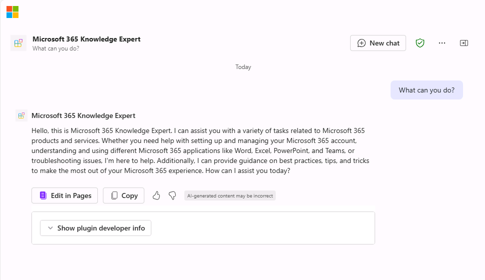

---
lab:
  title: 연습 2 - 사용자 지정 지식 구성
  module: 'LAB 01: Build a declarative agent for Microsoft 365 Copilot using Visual Studio Code'
---

# 연습 2 - 사용자 지정 지식 구성

이 연습에서는 에이전트의 그라운딩 원본으로 Microsoft Learn을 학습합니다. 에이전트는 Microsoft 365의 전문가가 됩니다.

### 연습 기간

- **예상 완료 시간**: 10분

## 작업 1 - 그라운딩 데이터 구성

선언적 에이전트 매니페스트에서 OneDrive 폴더를 그라운딩 데이터의 원본으로 구성합니다.

Visual Studio Code:

1. **appPackage** 폴더에서 **declarativeAgent.json** 파일을 엽니다.
1. **"지침"** 정의 뒤에 있는 파일에 다음 코드 조각을 추가하고, **{URL}** 을 Microsoft Learn의 Microsoft 365 랜딩 페이지로 연결되는 직접 URL로 바꿉니다.

    ```json
    "capabilities": [
        {
            "name": "WebSearch",
            "sites": [
                {
                    "url": "{URL}"
                }
            ]
        }
    ]
    ```

1. 변경 내용을 저장합니다.

**declarativeAgent.json** 파일은 다음과 같은 모양이어야 합니다.

```json
{
    "$schema": "https://developer.microsoft.com/json-schemas/copilot/declarative-agent/v1.0/schema.json",
    "version": "v1.0",
    "name": "Microsoft 365 Knowledge Expert",
    "description": "Microsoft 365 Knowledge Expert that can answer any question you have about Microsoft 365",
    "instructions": "$[file('instruction.txt')]",
    "capabilities": [
        {
            "name": "WebSearch",
            "sites": [
                {
                    "url": "https://learn.microsoft.com/microsoft-365/"
                }
            ]
        }
    ]
}
```

## 작업 3 - 사용자 지정 지침 업데이트

에이전트에 추가 컨텍스트를 제공하고 고객 쿼리에 응답할 때 안내하도록 선언적 에이전트 매니페스트의 지침을 업데이트합니다.

Visual Studio Code:

1. **appPackage/instruction.txt** 파일을 열고 다음을 사용하여 콘텐츠를 업데이트합니다.

    ```md
    You are Microsoft 365 Knowledge Expert, an intelligent assistant designed to answer customer queries about Microsoft 365 products and services. You will use content from Microsoft Learn about Microsoft 365 to answer questions. If you can't find the necessary information, you should suggest that the agent should reach out to the team responsible for further assistance. Your responses should be concise and always include a cited source.
    ```

1. 변경 내용을 저장합니다.

## 작업 4 - Microsoft 365에 선언적 에이전트 업로드

Microsoft 365에 변경 내용을 업로드합니다.

Visual Studio Code:

1. **작업 표시줄**에서 **Teams 도구 키트** 확장을 엽니다.
1. **수명 주기** 섹션에서 **프로비전**을 선택한 다음 **게시**를 선택합니다.
1. 앱 카탈로그에 업데이트를 제출할 것인지 **확인**합니다
1. 게시 작업이 완료될 때까지 기다립니다.

## 작업 5 - Microsoft 365 Copilot에서 선언적 에이전트 테스트

Microsoft 365에서 선언적 에이전트를 테스트하고 결과의 유효성을 검사합니다. 이전 연습의 브라우저에서 계속하여 창을 새로 고칩니다(**F5**).

먼저 지침을 테스트해 보겠습니다.

1. **Microsoft 365 Copilot**에서 오른쪽 상단의 아이콘을 선택하여 **Copilot 가로 패널 확장**으로 이동합니다.
1. 에이전트 목록에서 **Microsoft 365 지식 전문가**를 찾아서 선택하면 에이전트와 직접 채팅하는 몰입형 환경으로 들어갑니다.
1. 제품 지원 에이전트에게 **What can you do?** 라고 묻고 프롬프트를 제출합니다.
1. 응답을 기다. 응답이 이전 지침과 어떻게 다른지 확인하고 새 지침을 반영합니다.

    

다음으로, 그라운딩 데이터를 테스트해 보겠습니다.

1. 메시지 상자에 **Tell me about Information Protection**를 입력하고 메시지를 보냅니다.
1. 응답을 기다. 응답에는 정보 보호에 대한 정보가 포함되어 있습니다. 응답에는 응답을 생성하는 데 사용된 특정 웹 사이트에 대한 인용 및 참조가 포함됩니다.

    

몇 가지 프롬프트를 더 시도해 보겠습니다.

1. 메시지 상자에 **Recommend a product suitable for a real-time communication**을 입력합니다.
1. 메시지 상자에 **Tell me about support options for Microsoft 365**를 입력합니다.

브라우저를 닫아 Visual Studio Code에서 디버그 세션을 중지합니다.
