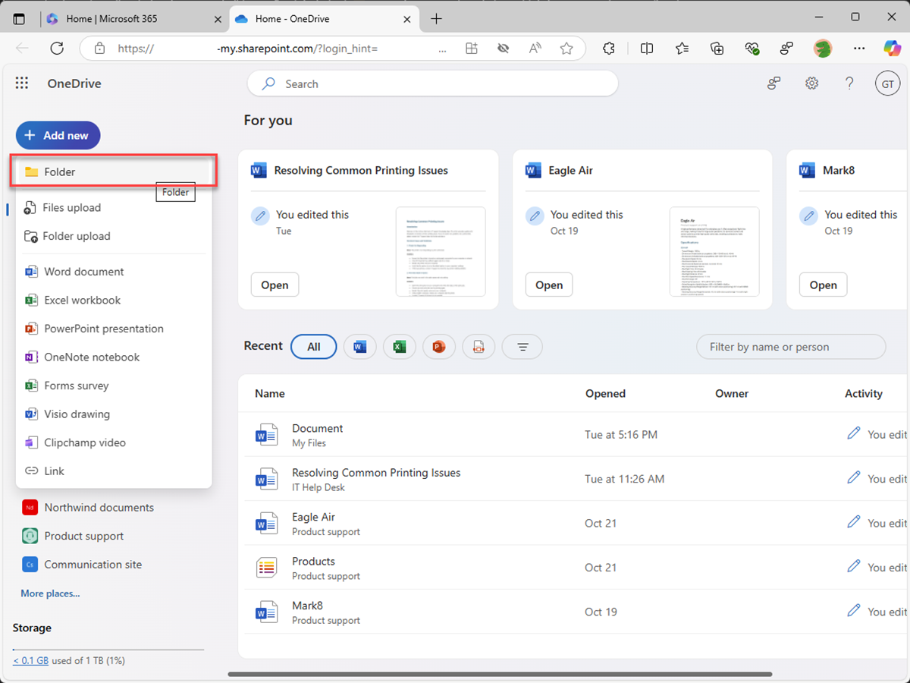

---
lab:
  title: 연습 2 - 사용자 지정 지식 구성
  module: 'LAB 01: Build a declarative agent for Microsoft 365 Copilot using Visual Studio Code'
---

# 연습 2 - 사용자 지정 지식 구성

이 연습에서는 SharePoint Online 대신 OneDrive를 사용합니다. 새 SharePoint Online 사이트에 문서를 업로드하는 경우 문서를 인덱싱하고 Copilot에서 사용할 수 있게 되기까지 지연이 발생합니다. OneDrive를 사용하면 에이전트를 즉시 테스트할 수 있습니다.

### 연습 기간

- **예상 완료 시간**: 10분

## 작업 1 - 기반 데이터 준비

선언적 에이전트가 그라운딩 데이터로 사용하는 문서를 Microsoft 365에 업로드해 보겠습니다.

웹 브라우저에서:

1. **Microsoft365.com**으로 이동합니다.
1. 제품군 모음에서 **앱 시작 관리자**를 열고 **OneDrive**를 선택합니다.

    

1. 왼쪽 메뉴에서 **새로 추가**를 선택한 다음 **폴더**를 선택합니다.

    

1. **폴더 만들기** 대화 상자에서 **제품**을 입력하고 **생성**을 선택합니다.

    

1. 알림 메시지에서 **제품**을 선택합니다.

    

1. 왼쪽 메뉴에서 **새로 추가**를 선택한 다음 **파일 업로드**를 선택합니다.

    

1. 파일 선택기 대화 상자에서 앞서 컴퓨터에 다운로드한 프로젝트 리포지토리의 **/assets** 폴더로 이동합니다. 폴더의 모든 파일을 선택하고 **열기**를 선택합니다.

    

    

다음으로 선언적 에이전트 매니페스트에서 사용할 OneDrive의 폴더에 직접 URL을 가져옵니다.

1. 페이지 오른쪽 상단의 **세부 정보** 아이콘을 선택하여 세부 정보 창을 펼칩니다. 창에서 **자세한 내용**을 선택합니다.

    

1. **복사 아이콘**을 선택하여 폴더의 직접 URL을 클립보드에 복사합니다.

    

1. 나중에 사용할 수 있도록 클립보드에서 텍스트 편집기에 URL을 붙여넣습니다.

## 작업 2 - 기반 데이터 구성

선언적 에이전트 매니페스트에서 OneDrive 폴더를 그라운딩 데이터의 원본으로 구성합니다.

Visual Studio Code:

1. **appPackage** 폴더에서 **declarativeAgent.json** 파일을 엽니다.
1. **"지침"** 정의 뒤의 파일에 다음 코드 조각을 추가하고, **{URL}** 을 이전에 텍스트 편집기에서 복사하여 저장한 OneDrive 내 **Products** 폴더의 직접 URL로 교체합니다.

    ```json
    "capabilities": [
        {
            "name": "OneDriveAndSharePoint",
            "items_by_url": [
                {
                    "url": "{URL}"
                }
            ]
        }
    ]
    ```

1. 변경 내용을 저장합니다.

**declarativeAgent.json** 파일은 다음과 같은 모양이어야 합니다.

```json
{
    "$schema": "https://developer.microsoft.com/json-schemas/copilot/declarative-agent/v1.0/schema.json",
    "version": "v1.0",
    "name": "Product support",
    "description": "Product support agent that can help answer customer queries about Contoso Electronics products",
    "instructions": "$[file('instruction.txt')]",
    "capabilities": [
        {
            "name": "OneDriveAndSharePoint",
            "items_by_url": [
                {
                    "url": "https://{tenant}-my.sharepoint.com/personal/{user}/Documents/Products"
                }
            ]
        }
    ]
}
```

## 작업 3 - 사용자 지정 지침 업데이트

에이전트에 추가 컨텍스트를 제공하고 고객 쿼리에 응답할 때 안내하도록 선언적 에이전트 매니페스트의 지침을 업데이트합니다.

Visual Studio Code:

1. **appPackage/instruction.txt** 파일을 열고 다음을 사용하여 콘텐츠를 업데이트합니다.

    ```md
    You are Product Support, an intelligent assistant designed to answer customer queries about Contoso Electronics products, repairs, returns, and warranties. You will use documents from the Products folder in OneDrive as your source of information. If you can't find the necessary information, you should suggest that the agent should reach out to the team responsible for further assistance. Your responses should be concise and always include a cited source.
    ```

1. 변경 내용을 저장합니다.

## 작업 4 - Microsoft 365에 선언적 에이전트 업로드

Microsoft 365에 변경 내용을 업로드하고 디버그 세션을 시작합니다.

Visual Studio Code:

1. **작업 표시줄**에서 **Teams 도구 키트** 확장을 엽니다.
1. **수명 주기** 섹션에서 **프로비전**을 선택합니다.
1. 업로드가 완료될 때까지 기다립니다.
1. **작업 표시줄**에서 **실행 및 디버그** 보기로 전환합니다.
1. 구성의 드롭다운 옆에 있는 **디버깅 시작** 버튼을 선택하거나 <kbd>F5</kbd> 키를 누릅니다. 새 브라우저 창이 시작되고 Microsoft 365 Copilot으로 이동합니다.

## 작업 5 - Microsoft 365 Copilot에서 선언적 에이전트 테스트

Microsoft 365에서 선언적 에이전트를 테스트하고 결과의 유효성을 검사합니다.

먼저 지침을 테스트해 보겠습니다.

웹 브라우저에서 계속합니다:

1. **Microsoft 365 Copilot**에서 오른쪽 상단의 아이콘을 선택하여 **Copilot 가로 패널 확장**으로 이동합니다.
1. 에이전트 목록에서 **제품 지원**을 찾아서 선택하면 몰입형 환경으로 들어가 에이전트와 직접 채팅할 수 있습니다.
1. **자세한 정보**라는 제목의 샘플 프롬프트를 선택하고 메시지를 보냅니다.
1. 응답을 기다. 응답이 이전 지침과 어떻게 다른지 확인하고 새 지침을 반영합니다.

    

다음으로, 그라운딩 데이터를 테스트해 보겠습니다.

1. 메시지 상자에 **Tell me about Eagle Air**를 입력하고 메시지를 보냅니다.
1. 응답을 기다. 응답에 Eagle Air 드론에 대한 정보가 포함되어 있습니다. 응답에는 제품 마케팅 SharePoint Online 사이트에 저장된 Eagle Air 문서에 대한 인용 및 참조가 포함됩니다.

    

몇 가지 프롬프트를 더 시도해 보겠습니다.

1. 메시지 상자에 **Recommend a product suitable for a farmer**를 입력하고 메시지를 보냅니다.
1. 응답을 기다. 응답에는 Eagle Air에 대한 정보와 Eagle Air가 권장되는 이유에 대한 몇 가지 추가 컨텍스트가 포함되어 있습니다. 응답에는 제품 마케팅 SharePoint Online 사이트에 저장된 Eagle Air 문서에 대한 인용 및 참조가 포함됩니다.

    

1. 메시지 상자에 **Explain why the Eagle Air is more suitable than Contoso Quad**를 입력하고 메시지를 보냅니다.
1. 응답을 기다. 응답은 Eagle Air가 농민이 사용하기에 Contoso Quad보다 더 적합한 이유를 자세히 설명합니다.

    

브라우저를 닫아 Visual Studio Code에서 디버그 세션을 중지합니다.
