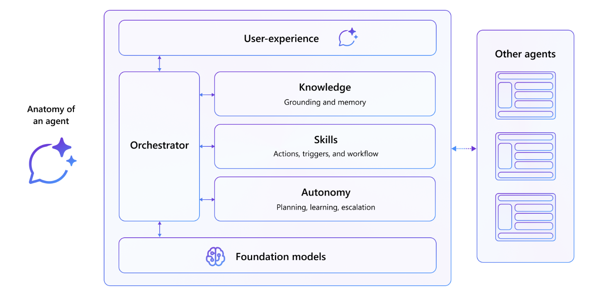

---
lab:
  title: 소개
  module: 'LAB 02: Build your first action for declarative agents with API plugin by using Visual Studio Code'
---

# 소개

Microsoft 365 Copilot 에이전트를 사용하면 특정 시나리오에 최적화된 AI 지원 도우미를 만들 수 있습니다. 지침을 사용하여 에이전트의 컨텍스트를 정의하고 음성 톤 또는 응답 방법과 같은 설정을 지정합니다. 에이전트의 기술을 구성하면 외부 시스템과 상호 작용하거나, 시스템 조건에서 특정 동작을 트리거하거나, 사용자 지정 워크플로 논리를 사용할 수 있습니다. 기술의 한 가지 유형은 선언적 에이전트가 데이터를 검색하고 수정하기 위해 API와 통신할 수 있도록 하는 작업입니다.

## 예제 시나리오

현지 레스토랑에서 정기적으로 음식을 주문하는 조직에서 일한다고 가정해 보겠습니다. 이 레스토랑은 인터넷에 게시하는 일일 메뉴로 운영됩니다. 이용 가능한 코스를 빠르게 확인할 수 있을 뿐만 아니라 손님이 있을 경우를 대비해 알레르기 유발 물질도 고려할 수 있어야 합니다. 레스토랑은 API를 통해 메뉴를 노출합니다. 별도의 앱을 빌드하는 대신 Microsoft 365 Copilot에 정보를 통합하여 주문하고 재료를 찾을 수 있는 이용 가능한 요리를 쉽게 찾을 수 있습니다. 자연어를 사용하여 메뉴를 탐색하고 주문을 하려고 합니다.

## 이 모듈에서 수행할 작업

이 모듈에서는 API 플러그 인을 사용하여 선언적 에이전트에 대한 작업을 빌드합니다. 이 작업을 통해 에이전트는 익명 API를 사용하여 외부 시스템과 상호 작용할 수 있습니다. 이 문서에서 학습할 내용은 다음과 같습니다.

- **만들기**: 익명 API에 연결하는 API 플러그 인을 만듭니다.
- **구성**: API의 데이터를 표시하도록 API 플러그 인을 구성합니다.
- **확장**: API 플러그 인을 사용하는 작업으로 선언적 에이전트를 확장합니다.
- **프로비전**: Microsoft 365 Copilot에 선언적 에이전트를 업로드하고 결과의 유효성을 검사합니다.

## 랩 기간

- **예상 완료 시간**: 35분

## 학습 목표

이 모듈을 마치면 익명 API에 연결된 API 플러그 인과 선언적 에이전트를 통합하여 외부 시스템과 실시간으로 상호 작용할 수 있는 방법을 알게됩니다.