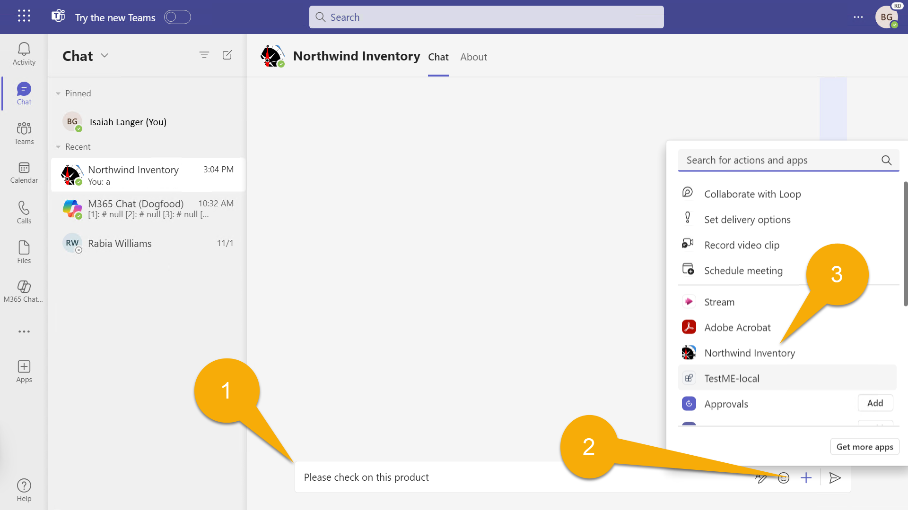
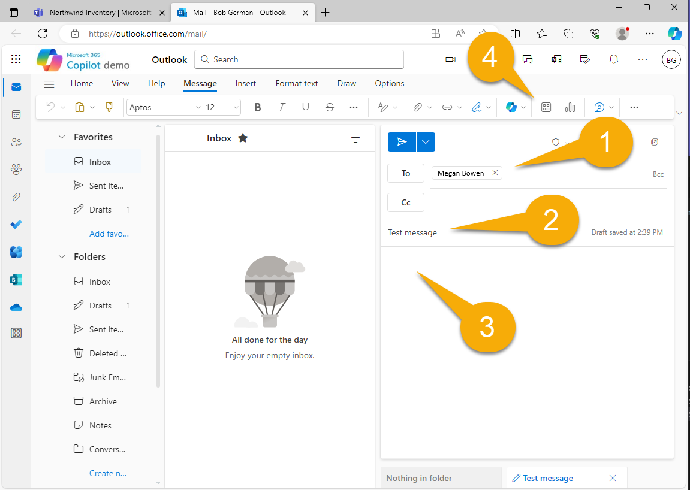
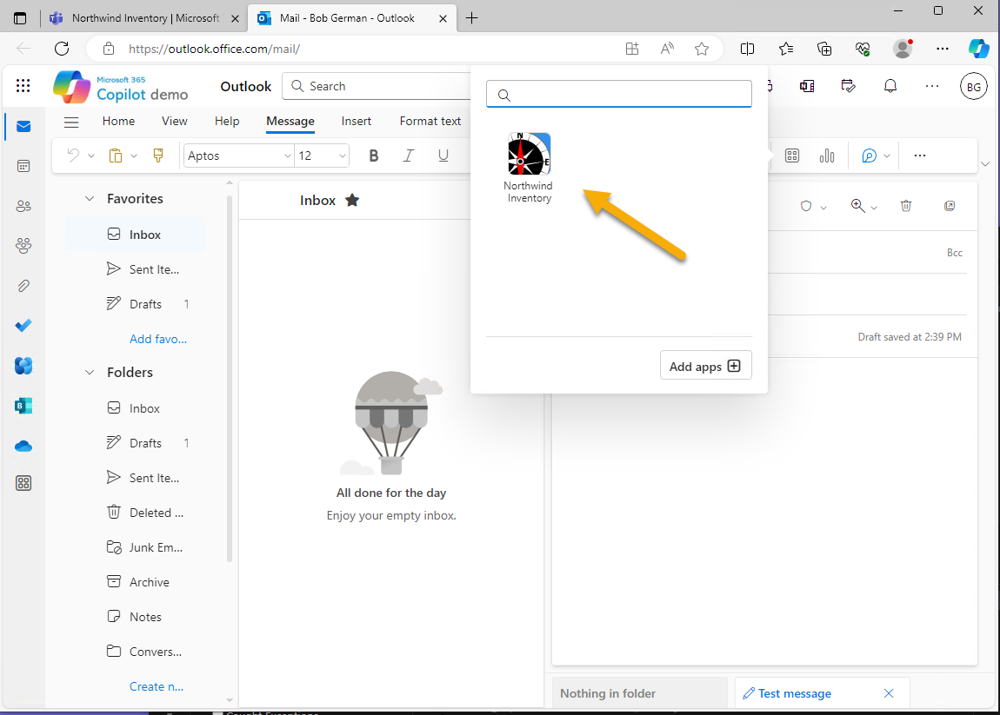
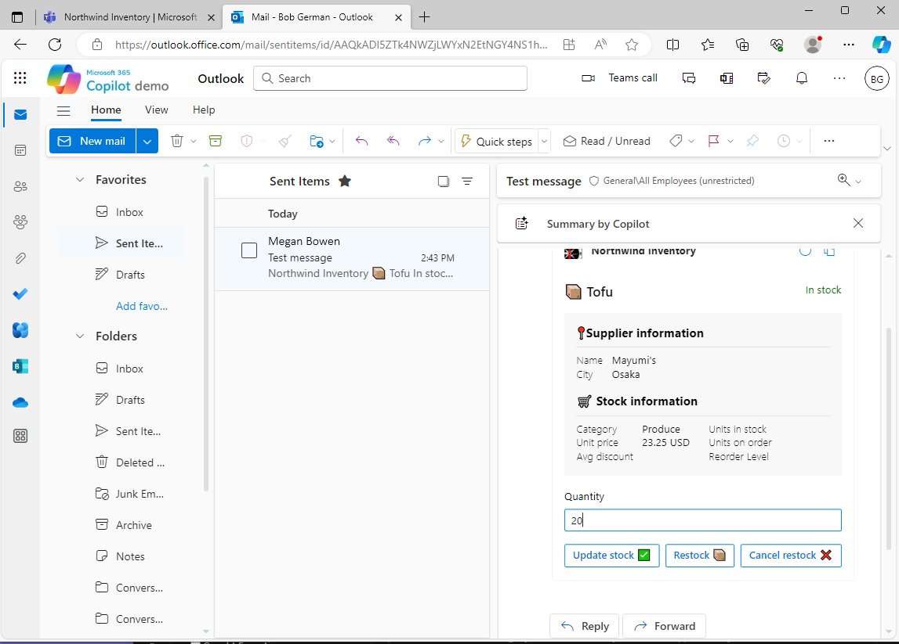
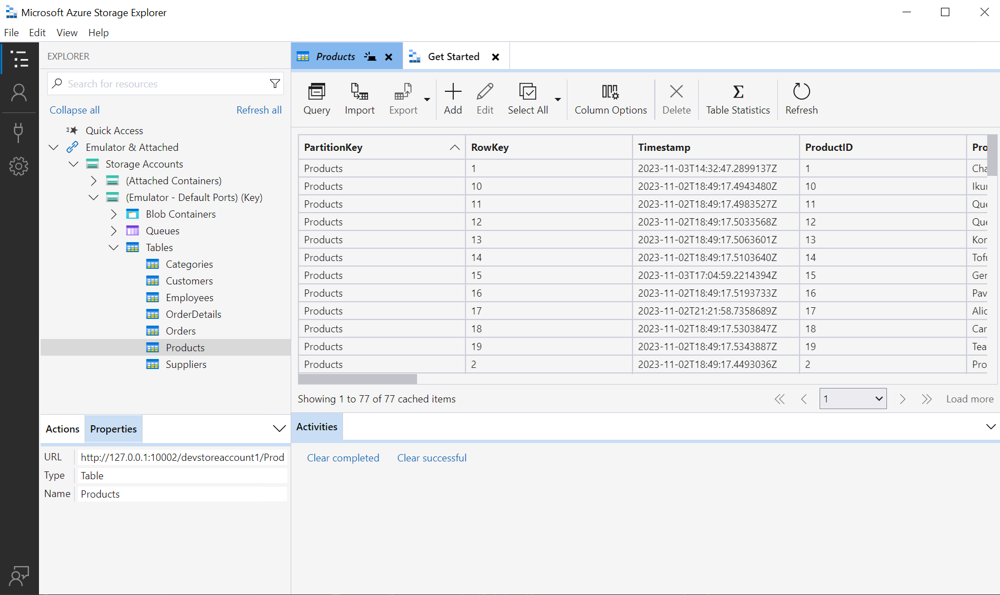

---
lab:
  title: 연습 1 - 샘플 메시지 확장으로 실행
  module: 'LAB 02: Build your own message extension plugin with TypeScript (TS) for Microsoft Copilot'
---

# 연습 1 - 샘플 메시지 확장으로 실행

이 연습에서는 Teams 및 Outlook용 플러그인으로 애플리케이션을 실행합니다. 다양한 프롬프트로 실험하고 여러 매개 변수를 사용하여 플러그인이 호출되는 방식을 관찰합니다.

## 작업 1 - 처음 사용할 프로젝트 설정

이 프로젝트에서 Northwind 데이터베이스는 Azure Table Storage에 저장됩니다. 로컬로 디버깅하는 경우 [Azurite](https://learn.microsoft.com/azure/storage/common/storage-use-azurite?tabs=visual-studio) 스토리지 에뮬레이터를 사용합니다. 이는 대부분 프로젝트에 기본 제공되지만 연결 문자열 제공하지 않으면 프로젝트가 빌드되지 않습니다.

Teams Toolkit은 환경 변수를 **env** 폴더에 저장하며 프로젝트를 처음 시작할 때 모든 값을 자동으로 채웁니다. 그러나 샘플 애플리케이션과 관련된 값이 하나 있으며 이는 Northwind 데이터베이스에 액세스하기 위한 연결 문자열입니다. 필요한 설정은 **env/.env.local.user.sample**파일에서 제공됩니다. 

**env** 폴더에서 이 파일의 복사본을 만들고 **.env.local.user**라고 부릅니다. 비밀 또는 중요한 설정이 저장되는 위치입니다.

 Visual Studio Code에서 이 작업을 수행하는 방법을 잘 모르는 경우: 

1. **env** 폴더를 확장하고 **.env.local.user.sample**을 마우스 오른쪽 단추로 클릭합니다. **복사**를 선택합니다. 

1. 그런 다음 **env** 폴더의 아무 곳이나 마우스 오른쪽 단추로 클릭하고 **붙여넣기**를 선택합니다. **.env.local.user copy.sample**이라는 새 파일이 생깁니다. 

1. 동일한 컨텍스트 메뉴를 사용하여 파일 이름을 **.env.local.user**로 변경하면 완료됩니다.

    

결과 **.env.local.user** 파일에는 다음 줄이 포함되어야 합니다.

```console
SECRET_BOT_PASSWORD=
SECRET_STORAGE_ACCOUNT_CONNECTION_STRING=UseDevelopmentStorage=true
```

## 작업 2 - 로컬에서 애플리케이션 실행하기

1. **작업 폴더**가 열려 있는 Visual Studio Code에서 **F5** 키를 눌러 디버깅을 시작하거나 시작 단추 1️⃣를 선택합니다.

1. **Teams(Edge)에서 디버그** 2️⃣를 선택합니다.

    

    앱을 처음 실행할 때 NodeJS가 방화벽을 통과하도록 허용하라는 메시지가 표시될 수 있습니다. 애플리케이션이 통신하도록 허용하려면 이 작업이 필요합니다.

    처음에 모든 npm 패키지를 로드하는 경우에는 다소 시간이 걸릴 수 있습니다. 결국 브라우저 창이 열리고 로그인하라는 알림이 표시됩니다.

    

    로그인하면 Microsoft Teams에서 애플리케이션을 설치하기 위한 대화 상자를 열고 표시합니다. 표시되는 정보를 살펴봅니다. 이러한 정보는 **앱 매니페스트**에서 파생됩니다.

1. **추가**를 선택하여 Northwind 인벤토리를 개인 애플리케이션으로 추가합니다.

    

> [!NOTE]
> 이 화면이 표시되면 **env/.env.local.user** 파일을 수정해야 합니다. 이 내용은 이전 작업에서 설명했습니다.
>
> 

애플리케이션 내의 채팅으로 리디렉션되어야 하지만 모든 채팅의 앱을 사용할 수 있습니다.

## 작업 3 - Microsoft Teams에서 테스트

1. **Northwind 인벤토리 채팅**에서 제품을 참조하는 메시지 1️⃣ 입력을 시작합니다. 그런 다음 제품에 대한 적응형 카드를 삽입하려면 **+** 2️⃣을 선택합니다. 

1. 플라이업 패널에서 방금 설치한 **Northwind 인벤토리** 애플리케이션 3️⃣을 선택합니다.

    

  2개의 탭이 있는 검색 대화 상자 1️⃣가 표시됩니다. **제품 인벤토리** 탭에서는 이름으로 제품을 검색할 수 있습니다.

1. 검색 상자 2️⃣에 제품 이름 또는 제품 이름 첫 글자(예: **chai**)를 입력합니다. 첫 글자를 입력할 때 일시 중지하면 동일한 문자로 시작하는 제품을 더 많이 선택할 수 있습니다.

1. **짜이** 3️⃣ 를 선택하여 설명과 함께 대화에 적응형 카드를 삽입합니다.

    

1. 카드를 볼 수 있지만 보낼 때까지 사용할 수는 없습니다. 메시지를 마지막으로 편집하고 **보내기**를 선택합니다. 주문에는 짜이가 없습니다 1️⃣. 자주 짜이를 마시는 사람이 있는 것이 틀림 없고 그 사람들이 자주 들를 수 있으므로 더 많이 주문하는 것이 좋습니다. 

    

    > [!NOTE]
    > 카드를 보낼 때까지 적응형 카드 동작이 작동하지 않습니다. 오류가 발생하면 메시지를 보낸 후에 카드로 작업하고 있는지 검사하고 확인합니다.

1. **작업 수행** 버튼 2️⃣를 선택하여 하위 카드를 엽니다. 수량 3️⃣을 입력하고 **재입고** 버튼 4️⃣를 선택합니다. 카드는 성공 메시지와 주문에 따라 업데이트된 단위 수로 새로 고쳐집니다.

    

다른 두 버튼을 사용하여 주문을 취소하거나 재고 수준을 수정할 수 있습니다.

## 작업 4 - 고급 쿼리

Visual Studio Code로 돌아가서 **appPackage** 디렉터리에서 **manifest.json**이라는 앱 매니페스트 파일을 엽니다. 앱을 설치할 때 표시된 앱 정보가 모두 여기에 있음을 알 수 있습니다. 아래로 스크롤하여 찾습니다 `composeExtensions:`. 

```json
"composeExtensions": [
    {
        "botId": "${{BOT_ID}}",
        "commands": [
            {
                "id": "inventorySearch",
                ...
                "description": "Search products by name, category, inventory status, supplier location, stock level",
                "title": "Product inventory",
                "type": "query",
                "parameters": [ ... ]
            },
            {
                "id": "discountSearch",
                ...
                "description": "Search for discounted products by category",
                "title": "Discounts",
                "type": "query",
                "parameters": [ ...]
            }
        ]
    }
],
```

> [!NOTE]
> 확장 작성은 메시지 확장의 기록 이름입니다. Northwind 인벤토리 메시지 확장은 여기에 정의되어 있습니다.

먼저 Azure 봇 채널을 사용하여 애플리케이션과 안전한 실시간 메시지를 교환하는 Microsoft Teams에서 프로비저닝한 **봇 ID**를 확인합니다. Teams Toolkit는 봇을 등록하고 ID를 입력합니다.

다음으로 명령 컬렉션을 관찰합니다. 이는 Teams의 검색 대화 상자의 탭에 해당합니다. 이 애플리케이션에서 명령은 주로 일반 사용자보다는 Copilot을 대상으로 합니다.

이름으로 제품을 검색할 때 이미 첫 번째 명령을 실행했습니다. 다른 명령을 사용해 보려면 **Beverages**, **Dairy** 또는 **Produce**을 **할인** 탭에 입력합니다. 입력 후 해당 범주의 할인 제품이 표시되는 것을 확인할 수 있습니다. Copilot에서는 쿼리를 사용하여 할인된 제품에 대한 질문에 답변할 수 있습니다.


이제 첫 번째 명령을 다시 검합니다. 5개 매개 변수가 있습니다.

```json
"parameters": [
    {
        "name": "productName",
        "title": "Product name",
        "description": "Enter a product name here",
        "inputType": "text"
    },
    {
        "name": "categoryName",
        "title": "Category name",
        "description": "Enter the category of the product",
        "inputType": "text"
    },
    {
        "name": "inventoryStatus",
        "title": "Inventory status",
        "description": "Enter what status of the product inventory. Possible values are 'in stock', 'low stock', 'on order', or 'out of stock'",
        "inputType": "text"
    },
    {
        "name": "supplierCity",
        "title": "Supplier city",
        "description": "Enter the supplier city of product",
        "inputType": "text"
    },
    {
        "name": "stockQuery",
        "title": "Stock level",
        "description": "Enter a range of integers such as 0-42 or 100- (for >100 items). Only use if you need an exact numeric range.",
        "inputType": "text"
    }
]
```

Teams는 첫 번째 매개 변수만 표시할 수 있지만 Copilot은 총 5개 사용할 수 있으므로 Northwind 인벤토리 데이터의 고급 쿼리를 수행할 수 있습니다. Teams UI 제한에 대한 해결 방법으로 **Northwind 인벤토리** 탭은 다음 형식을 사용하여 최대 5개의 쉼표로 구분된 매개 변수를 허용합니다.

```console
name,category,inventoryStatus,supplierCity,supplierName
```


쿼리를 입력할 때 위의 JSON에서 설명을 주의 깊게 읽습니다. 아래에 나열된 용어를 입력하고, 마찬가지로 Visual Studio Code의 디버그 콘솔 탭을 주시합니다. 여기서 각 쿼리가 실행되는 것이 표시됩니다.

- **_chai_** - **chai**로 시작하는 이름을 가진 제품을 찾습니다.

- **_c,bev_** - **bev**로 시작하는 범주의 제품 및 **c**로 시작하는 이름을 찾습니다.

- **_,,out,_** - 재고가 없는 제품을 찾습니다.

- **_,,in,London_** - London의 공급 업체에서 주문하는 제품을 찾습니다.

- **_tofu,produce,,Osaka_** - **produce**범주에서 **Osaka**의 공급 업체와 **tofu**로 시작하는 이름의 제품을 찾을 수 있습니다.

각 쿼리 용어는 제품 목록을 필터링합니다. 각 쿼리 용어의 형식은 임의이므로 각 매개 변수에 대한 설명에서 Copilot에 쿼리를 설명해 주어야 합니다.

## 작업 5 - Microsoft Outlook에서 테스트

Microsoft Outlook에서 메시지 확장이 작동하는 방식을 확인할 수 있도록 잠시 우회해 보겠습니다.

1. 먼저 Microsoft 365 앱 메뉴 1️⃣을 열고 **Outlook** 2️⃣.를 선택합니다.

    

1. **새 메일**을 선택하여 이메일 작성을 시작합니다.

    

1. **받는 사람** 1️⃣ 및 **주제** 2️⃣를 추가한 다음 메세지 3️⃣의 본문에 커서를 놓습니다. 또한 기타 내용을 입력할 수도 있습니다. 준비가 되면 도구 모음에서 **삽입**을 선택하고 도구 모음 4️⃣에서 **앱**을 선택합니다.

    

1. 필요한 경우 검색하여 **Northwind 인벤토리** 애플리케이션을 선택합니다.

    

1. 앞서와 같이 **Chai** 1️⃣을 검색하고 결과를 선택한 다음 적응형 카드 2️⃣를 삽입합니다.

    

    

> [!NOTE]
> 적응형 카드는 메시지를 보낼 때까지 작동하지 않습니다. 수신자가 Microsoft Outlook을 사용하지 않는 경우 카드를 볼 수 없으며, 노스윈드 인벤토리 앱이 설치되어 있지 않은 경우 카드에 대한 조치를 취할 수 없습니다.

## 작업 6 - Azure Storage Explorer에서 노스윈드 데이터베이스 보기

Northwind 데이터베이스는 화려하지 않지만 진짜입니다! 데이터를 피킹 하거나 수정하려는 경우:

1. Azurite가 [실행되는 동안 Azure Storage Explorer](https://azure.microsoft.com/products/storage/storage-explorer/) 를 엽니다(앱을 실행하면 Azurite가 자동으로 시작됨).

1. **에뮬레이터 및 첨부파일**, **스토리지 계정**, **에뮬레이터 - 기본 포트**, **테이블**을 열어 Northwind 데이터를 확인합니다.

    

이 코드는 각 쿼리에서 **Products** 테이블을 읽지만 다른 테이블은 앱이 시작될 때만 액세스합니다. 따라서 새 카테고리를 추가하려면 앱을 다시 시작해야 해당 카테고리가 표시되도록 할 수 있습니다.

## 작업 확인

이 연습의 모든 작업을 수행한 후에는 Teams 또는 Outlook용 Microsoft 365 플러그인으로 사용할 수 있는 메시지 확장 응용 프로그램이 작동해야 합니다.

모든 것이 작동하면 **Microsoft Copilot for Microsoft 365**에서 샘플 애플리케이션을 실행할 준비가 된 것입니다! 

[다음 연습을 계속 진행합니다...](./4-exercise-2-run-copilot-plugin.md)
