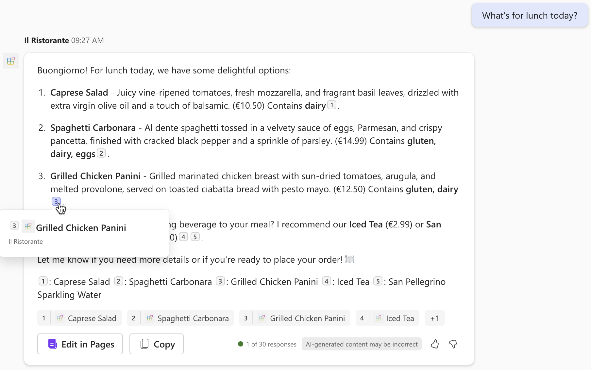
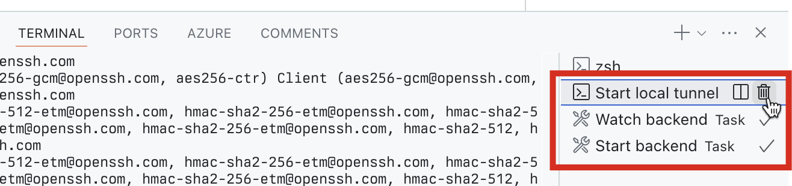

---
lab:
  title: 연습 4 - Microsoft 365 Copilot에서 API 플러그 인을 사용하여 선언적 에이전트 테스트
  module: 'LAB 02: Build your first action for declarative agents with API plugin by using Visual Studio Code'
---

# 연습 4 - Microsoft 365 Copilot에서 API 플러그 인을 사용하여 선언적 에이전트 테스트

작업을 사용하여 선언적 에이전트를 확장하면 외부 시스템에 저장된 데이터를 실시간으로 검색하고 업데이트할 수 있습니다. API 플러그 인을 사용하여 API를 통해 외부 시스템에 연결하여 정보를 검색하고 업데이트할 수 있습니다.

### 연습 기간

- **예상 완료 시간**: 10분

## 작업 1 - 선언적 에이전트 테스트

마지막 단계는 Microsoft 365 Copilot에서 API 플러그 인을 사용하여 선언적 에이전트를 테스트하는 것입니다.

Visual Studio Code:

1. **작업 표시줄**에서 **Teams 도구 키트**를 선택합니다.
1. **계정** 섹션에서 Microsoft 365 Copilot를 사용하여 Microsoft 365 테넌트에 로그인되었는지 확인합니다.

  

1. **작업 표시줄**에서 **실행 및 디버그**를 선택합니다.
1. **Copilot에서 디버그** 구성을 선택하고 **디버깅 시작** 버튼을 사용하여 디버깅을 시작합니다.  

  

1. Visual Studio Code는 프로젝트를 빌드하고 Microsoft 365 테넌트에 배포하고 새 웹 브라우저 창을 엽니다.

웹 브라우저에서:

1. 메시지가 표시되면 Microsoft 365 Copilot을 사용하여 Microsoft 365 테넌트에 속한 계정으로 로그인합니다.
1. 사이드 바에서 **Il Ristorante**를 선택합니다.

  

1. **What's for lunch today?** 대화 시작을 선택하고 프롬프트를 제출합니다.

  

1. 메시지가 표시되면 에이전트가 API로 전송하는 데이터를 검토하고 **한 번만 허용** 버튼을 사용하여 확인합니다.

  

1. 에이전트가 응답할 때까지 기다립니다. API에서 검색하는 정보에 대한 인용을 표시하지만 팝업에는 요리 제목만 표시됩니다. API 플러그 인이 적응형 카드 템플릿을 정의하지 않으므로 추가 정보는 표시되지 않습니다.

  

1. 프롬프트 텍스트 상자에 **1x spaghetti, 1x iced tea**와 같이 입력한 후 프롬프트를 제출합니다.
1. 에이전트가 API로 전송하는 데이터를 검토하고 **확인** 버튼을 계속 사용합니다.

  

1. 에이전트가 주문을 하고 주문 요약을 반환할 때까지 기다립니다. 다시 한번 에이전트는 적응형 카드 템플릿이 없기 때문에 주문 요약을 일반 텍스트로 표시합니다.

  

1. Visual Studio Code로 돌아가서 디버깅을 중지합니다.
1. **터미널** 탭으로 전환하고 활성화된 모든 터미널을 닫습니다.

  
