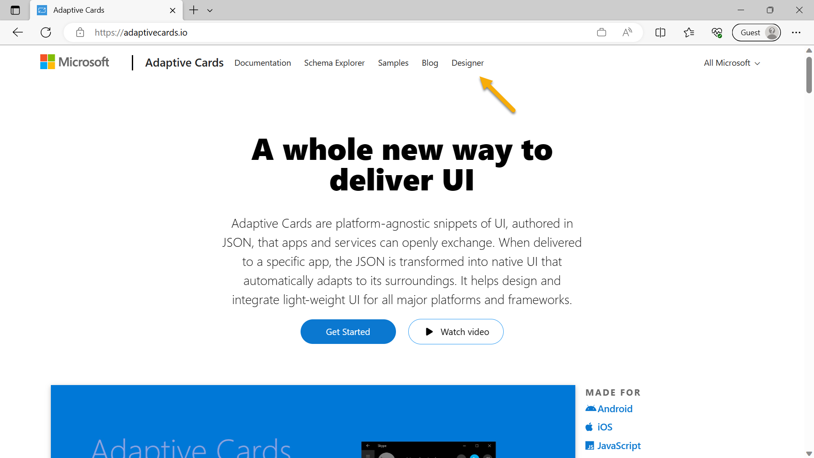

---
lab:
  title: 연습 4 - 플러그 인 소스 코드 탐색
  module: 'LAB 02: Build your own message extension plugin with TypeScript (TS) for Microsoft Copilot'
---

# 연습 4 - 플러그 인 소스 코드 탐색

이 연습에서는 **메시지 확장**의 작동 방식을 이해할 수 있도록 애플리케이션 코드를 검토합니다.

## 작업 1 - 매니페스트 검사

Microsoft 365 애플리케이션의 핵심은 애플리케이션 매니페스트입니다. 여기서는 Microsoft 365가 애플리케이션에 액세스하는 데 필요한 정보를 제공합니다.

**작업 디렉터리**에서 **appPackackage/manifest.json** 파일을 엽니다. 이 JSON 파일은 애플리케이션 패키지를 만들기 위해 두 개의 아이콘 파일이 있는 zip 보관 파일에 배치됩니다. **icons** 속성에는 이러한 아이콘의 경로가 포함됩니다.

```json
"icons": {
    "color": "Northwind-Logo3-192-${{TEAMSFX_ENV}}.png",
    "outline": "Northwind-Logo3-32.png"
},
```

아이콘 이름 중 하나에서 토큰 `${{TEAMSFX_ENV}}`을 확인합니다. Teams 도구 키트는 이 토큰을 **로컬** 또는 **개발**(개발 중인 Azure 배포용)과 같은 환경 이름으로 대체합니다. 따라서 아이콘 색은 환경에 따라 변경됩니다.

### 애플리케이션 설명

이제 **이름** 및 **설명**을 살펴보겠습니다. **설명**이 매우 길다는 것을 알 수 있습니다! 사용자와 Copilot이 애플리케이션이 수행하는 작업과 사용 시기를 학습할 수 있도록 하는 것이 중요합니다.

```json
    "name": {
        "short": "Northwind Inventory",
        "full": "Northwind Inventory App"
    },
    "description": {
        "short": "App allows you to find and update product inventory information",
        "full": "Northwind Inventory is the ultimate tool for managing your product inventory. With its intuitive interface and powerful features, you'll be able to easily find your products by name, category, inventory status, and supplier city. You can also update inventory information with the app. \n\n **Why Choose Northwind Inventory:** \n\n Northwind Inventory is the perfect solution for businesses of all sizes that need to keep track of their inventory. Whether you're a small business owner or a large corporation, Northwind Inventory can help you stay on top of your inventory management needs. \n\n **Features and Benefits:** \n\n - Easy Product Search through Microsoft Copilot. Simply start by saying, 'Find northwind dairy products that are low on stock' \r - Real-Time Inventory Updates: Keep track of inventory levels in real-time and update them as needed \r  - User-Friendly Interface: Northwind Inventory's intuitive interface makes it easy to navigate and use \n\n **Availability:** \n\n To use Northwind Inventory, you'll need an active Microsoft 365 account . Ensure that your administrator enables the app for your Microsoft 365 account."
    },
```

### 봇 정의

**ComposeExtensions**까지 조금 아래로 스크롤합니다. 작성 확장은 메시지 확장의 기록 용어이며, 여기서 앱의 메시지 확장이 정의됩니다. 메시지 확장은 Azure Bot Framework를 사용하여 통신하며, Microsoft 365와 애플리케이션 간에 빠르고 안전한 통신 채널을 제공합니다. 프로젝트를 처음 실행하면 Teams 도구 키트가 봇을 등록하고 여기에 **botID**를 배치합니다.

```json
    "composeExtensions": [
        {
            "botId": "${{BOT_ID}}",
            "commands": [
                {
                    ...
```

### 명령 정의

이 메시지 확장에는 `commands` 배열에 정의된 두 개의 명령이 있습니다. 이전 연습을 완료한 경우 회사 이름으로 검색하는 세 번째 명령도 있습니다. 이는 가장 복잡한 명령이므로 잠시 첫 번째 명령을 건너뛰겠습니다. 다음 명령을 사용하면 Copilot(또는 사용자)이 Northwind 범주 내에서 할인된 제품을 검색할 수 있습니다. 이 명령은 단일 매개 변수인 **categoryName**을 허용합니다.

```json
{
    "id": "discountSearch",
    "context": [
        "compose",
        "commandBox"
    ],
    "description": "Search for discounted products by category",
    "title": "Discounts",
    "type": "query",
    "parameters": [
        {
            "name": "categoryName",
            "title": "Category name",
            "description": "Enter the category to find discounted products",
            "inputType": "text"
        }
    ]
},
```

이제 매개 변수가 5개인 첫 번째 명령인 **inventorySearch**로 다시 이동하여 훨씬 더 정교한 쿼리를 허용해 보겠습니다.

```json
{
    "id": "inventorySearch",
    "context": [
        "compose",
        "commandBox"
    ],
    "description": "Search products by name, category, inventory status, supplier location, stock level",
    "title": "Product inventory",
    "type": "query",
    "parameters": [
        {
            "name": "productName",
            "title": "Product name",
            "description": "Enter a product name here",
            "inputType": "text"
        },
        {
            "name": "categoryName",
            "title": "Category name",
            "description": "Enter the category of the product",
            "inputType": "text"
        },
        {
            "name": "inventoryStatus",
            "title": "Inventory status",
            "description": "Enter what status of the product inventory. Possible values are 'in stock', 'low stock', 'on order', or 'out of stock'",
            "inputType": "text"
        },
        {
            "name": "supplierCity",
            "title": "Supplier city",
            "description": "Enter the supplier city of product",
            "inputType": "text"
        },
        {
            "name": "stockQuery",
            "title": "Stock level",
            "description": "Enter a range of integers such as 0-42 or 100- (for >100 items). Only use if you need an exact numeric range.",
            "inputType": "text"
        }
    ]
},
```

Copilot은 설명에 따라 이를 채울 수 있으며 메시지 확장은 비어 있지 않은 모든 매개 변수로 필터링된 제품 목록을 반환합니다.

## 작업 2 - 봇 코드 검사

이제 [Bot Builder SDK](https://learn.microsoft.com/azure/bot-service/index-bf-sdk)를 사용하여 Azure Bot Framework와 통신하는 봇에 대한 코드가 포함된 **src/searchApp.ts** 파일을 엽니다. 봇은 SDK 클래스 **TeamsActivityHandler**를 확장합니다.

```typescript
export class SearchApp extends TeamsActivityHandler {
  constructor() {
    super();
  }

  ...
```

### 메시지 확장 쿼리

애플리케이션은 **TeamsActivityHandler**의 메서드를 재정의하여 Microsoft 365에서 들어오는 메시지(**활동**이라고 함)를 처리할 수 있습니다.

이 중 첫 번째는 **메시징 확장 쿼리** 작업입니다. 이 함수는 사용자가 메시지 확장에 입력하거나 Copilot이 호출할 때 호출됩니다. 처리기가 **commandID**를 기반으로 쿼리를 디스패치합니다. 이는 앱 매니페스트에서 사용되는 것과 동일한 commandID입니다.

```typescript
  // Handle search message extension
  public async handleTeamsMessagingExtensionQuery(
    context: TurnContext,
    query: MessagingExtensionQuery
  ): Promise<MessagingExtensionResponse> {

    switch (query.commandId) {
      case productSearchCommand.COMMAND_ID: {
        return productSearchCommand.handleTeamsMessagingExtensionQuery(context, query);
      }
      case discountedSearchCommand.COMMAND_ID: {
        return discountedSearchCommand.handleTeamsMessagingExtensionQuery(context, query);
      }
    }
  }
  ...
```

### 적응형 카드 작업

앱에서 처리해야 하는 다른 유형의 활동은 사용자가 적응형 카드에서 **재고 업데이트** 또는 **다시 정렬**을 선택하는 경우와 같은 적응형 카드 작업입니다. 적응형 카드 작업에 대한 특정 메서드는 없으므로 코드는 메시지 확장 쿼리를 포함하는 훨씬 더 광범위한 작업 클래스인 `onInvokeActivity()`를 재정의합니다. 이러한 이유로 코드는 작업 이름을 수동으로 확인하고 적절한 처리기로 디스패치합니다. 작업 이름이 적응형 카드 작업에 대한 이름이 아닌 경우 `else` 절은 `onInvokeActivity()`의 기본 구현을 실행합니다. 이 구현은 무엇보다도 **호출** 작업이 쿼리인 경우 `handleTeamsMessagingExtensionQuery()` 메서드를 호출합니다.

```typescript
import {
  TeamsActivityHandler,
  TurnContext,
  MessagingExtensionQuery,
  MessagingExtensionResponse,
  InvokeResponse
} from "botbuilder";
import productSearchCommand from "./messageExtensions/productSearchCommand";
import discountedSearchCommand from "./messageExtensions/discountSearchCommand";
import revenueSearchCommand from "./messageExtensions/revenueSearchCommand";
import actionHandler from "./adaptiveCards/cardHandler";

export class SearchApp extends TeamsActivityHandler {
  constructor() {
    super();
  }

  // Handle search message extension
  public async handleTeamsMessagingExtensionQuery(
    context: TurnContext,
    query: MessagingExtensionQuery
  ): Promise<MessagingExtensionResponse> {

    switch (query.commandId) {
      case productSearchCommand.COMMAND_ID: {
        return productSearchCommand.handleTeamsMessagingExtensionQuery(context, query);
      }
      case discountedSearchCommand.COMMAND_ID: {
        return discountedSearchCommand.handleTeamsMessagingExtensionQuery(context, query);
      }
    }

  }

  // Handle adaptive card actions
  public async onInvokeActivity(context: TurnContext): Promise<InvokeResponse> {
    let runEvents = true;
    // console.log (`🎬 Invoke activity received: ${context.activity.name}`);
    try {
      if(context.activity.name==='adaptiveCard/action'){
        switch (context.activity.value.action.verb) {
          case 'ok': {
            return actionHandler.handleTeamsCardActionUpdateStock(context);
          }
          case 'restock': {
            return actionHandler.handleTeamsCardActionRestock(context);
          }
          case 'cancel': {
            return actionHandler.handleTeamsCardActionCancelRestock(context);
          }
          default:
            runEvents = false;
            return super.onInvokeActivity(context);
        }
      } else {
          runEvents = false;
          return super.onInvokeActivity(context);
      }
    } 
```

## 작업 3 - 메시지 확장 명령 코드 검사

코드를 보다 모듈화하고 읽기 가능하며 재사용할 수 있도록 하기 위해 각 메시지 확장 명령은 자체 TypeScript 모듈에 배치됩니다. 예를 들어 **src/messageExtensions/discountSearchCommand.ts**를 살펴보세요.

먼저 모듈이 앱 매니페스트에 있는 것과 동일한 **commandID**를 포함하는 상수 `COMMAND_ID`를 내보내고 **searchApp.ts**의 switch 문이 제대로 작동하도록 허용하는지 확인합니다.

그런 다음 **범주별로 할인된 제품**에 대한 들어오는 쿼리를 처리하는 함수 `handleTeamsMessagingExtensionQuery()`를 제공합니다.

```typescript
async function handleTeamsMessagingExtensionQuery(
    context: TurnContext,
    query: MessagingExtensionQuery
): Promise<MessagingExtensionResponse> {

    // Seek the parameter by name, don't assume it's in element 0 of the array
    let categoryName = cleanupParam(query.parameters.find((element) => element.name === "categoryName")?.value);
    console.log(`💰 Discount query #${++queryCount}: Discounted products with categoryName=${categoryName}`);

    const products = await getDiscountedProductsByCategory(categoryName);

    console.log(`Found ${products.length} products in the Northwind database`)
    const attachments = [];
    products.forEach((product) => {
        const preview = CardFactory.heroCard(product.ProductName,
            `Avg discount ${product.AverageDiscount}%<br />Supplied by ${product.SupplierName} of ${product.SupplierCity}`,
            [product.ImageUrl]);

        const resultCard = cardHandler.getEditCard(product);
        const attachment = { ...resultCard, preview };
        attachments.push(attachment);
    });
    return {
        composeExtension: {
            type: "result",
            attachmentLayout: "list",
            attachments: attachments,
        },
    };
}
```

`query.parameters` 배열의 인덱스가 매니페스트의 매개 변수 위치에 해당하지 않을 수 있습니다. 이는 일반적으로 다중 매개 변수 명령에 대한 문제이지만 코드는 인덱스 하드 코딩 대신 매개 변수 이름을 기반으로 값을 가져옵니다.

매개 변수를 정리하고 경우에 따라 Copilot이 "**\***"이 모든 항목과 일치하는 와일드카드라고 가정한다는 사실을 처리한 후 코드는 Northwind 데이터 액세스 계층을 `getDiscountedProductsByCategory()`에 호출합니다.

그런 다음, 제품을 반복하고 각각에 대해 두 개의 카드를 만듭니다.

- **hero** 카드로 구현되는 _미리 보기_ 카드. 이는 사용자 인터페이스의 검색 결과 및 Copilot의 일부 인용에 표시됩니다.

- 모든 세부 정보를 포함하는 **적응형** 카드로 구현되는 _결과_ 카드.

다음 작업에서는 적응형 카드 코드를 검토하고 적응형 카드 디자이너를 확인합니다.

## 작업 4 - 적응형 카드 및 관련 코드 검사

프로젝트의 적응형 카드는 **src/adaptiveCards/** 폴더에 있습니다. 각각 JSON 파일로 구현되는 3개의 카드가 있습니다.

- **editCard.json** - 메시지 확장 또는 Copilot 참조로 표시되는 초기 카드입니다.

- **successCard.json** - 사용자가 작업을 수행하면 성공을 나타내기 위해 이 카드가 표시됩니다. 사용자에게 메시지를 포함한다는 점을 제외하면 편집 카드와 대부분 동일합니다.

- **errorCard.json** - 작업이 실패하면 이 카드가 표시됩니다.

**적응형 카드 디자이너**에서 편집 카드를 살펴보겠습니다. 웹 브라우저를 [https://adaptivecards.io](https://adaptivecards.io)(으)로 열고 맨 위에 있는 **디자이너** 옵션을 선택합니다.



`"text": "📦 ${productName}",`과 같은 데이터 바인딩 식을 확인합니다. 이렇게 하면 데이터의 `productName` 속성을 카드의 텍스트에 바인딩합니다.

이제 호스트 애플리케이션 1️⃣으로 **Microsoft Teams**를 선택합니다. **editCard.json**의 전체 내용을 카드 페이로드 편집기 2️⃣에 붙여넣고 **sampleData.json**의 내용을 샘플 데이터 편집기 3️⃣에 붙여넣습니다. 샘플 데이터는 코드에 제공된 제품과 동일합니다. 디자이너가 적응형 카드 형식 중 하나를 표시할 수 없기 때문에 발생하는 작은 오류를 제외하고 카드가 렌더링된 것으로 표시됩니다.


페이지 위쪽에서 **테마** 및 **에뮬레이트된 디바이스**를 변경하여 카드가 어두운 테마 또는 모바일 디바이스에서 어떻게 표시되는지 확인합니다. 샘플 애플리케이션에 대한 적응형 카드를 빌드하는 데 사용된 도구입니다.

이제 Visual Studio Code로 돌아가서 **cardHandler.ts**를 엽니다. 함수 `getEditCard()`는 **결과** 카드를 얻기 위해 각 메시지 확장명 명령에서 호출됩니다. 이 코드는 템플릿으로 간주되는 적응형 카드 JSON을 읽은 다음 제품 데이터에 바인딩합니다. 그 결과 데이터 바인딩 식이 모두 채워진 템플릿과 동일한 카드인 더 많은 JSON이 생성됩니다. 마지막으로, `CardFactory` 모듈은 최종 JSON을 렌더링을 위한 적응형 카드 개체로 변환하는 데 사용됩니다.

```typescript
function getEditCard(product: ProductEx): any {

    var template = new ACData.Template(editCard);
    var card = template.expand({
        $root: {
            productName: product.ProductName,
            unitsInStock: product.UnitsInStock,
            productId: product.ProductID,
            categoryId: product.CategoryID,
            imageUrl: product.ImageUrl,
            supplierName: product.SupplierName,
            supplierCity: product.SupplierCity,
            categoryName: product.CategoryName,
            inventoryStatus: product.InventoryStatus,
            unitPrice: product.UnitPrice,
            quantityPerUnit: product.QuantityPerUnit,
            unitsOnOrder: product.UnitsOnOrder,
            reorderLevel: product.ReorderLevel,
            unitSales: product.UnitSales,
            inventoryValue: product.InventoryValue,
            revenue: product.Revenue,
            averageDiscount: product.AverageDiscount
        }
    });
    return CardFactory.adaptiveCard(card);
}
```

아래로 스크롤하면 카드의 각 작업 단추에 대한 처리기가 표시됩니다. 카드는 실행 단추를 클릭할 때 데이터를 제출합니다. 특히 카드의 **수량** 입력 상자인 `data.txtStock` 및 각 카드 작업에서 전송되어 코드에 업데이트할 제품을 알려주는 `data.productId`를 제출합니다.

```typescript
async function handleTeamsCardActionUpdateStock(context: TurnContext) {

    const request = context.activity.value;
    const data = request.action.data;
    console.log(`🎬 Handling update stock action, quantity=${data.txtStock}`);

    if (data.txtStock && data.productId) {

        const product = await getProductEx(data.productId);
        product.UnitsInStock = Number(data.txtStock);
        await updateProduct(product);

        var template = new ACData.Template(successCard);
        var card = template.expand({
            $root: {
                productName: product.ProductName,
                unitsInStock: product.UnitsInStock,
                productId: product.ProductID,
                categoryId: product.CategoryID,
                imageUrl: product.ImageUrl,
                ...
```

보다시피 코드는 이러한 두 값을 가져오고 데이터베이스를 업데이트한 다음 메시지와 업데이트된 데이터가 포함된 새 카드를 보냅니다.

## 축하합니다.

연습 5 및 Microsoft 365용 Copilot 메시지 확장 플러그 인 랩에 대해 완료했습니다. 해당 랩을 수행해 주셔서 대단히 감사합니다!

[랩 요약으로 계속 진행...](./7-summary.md)
