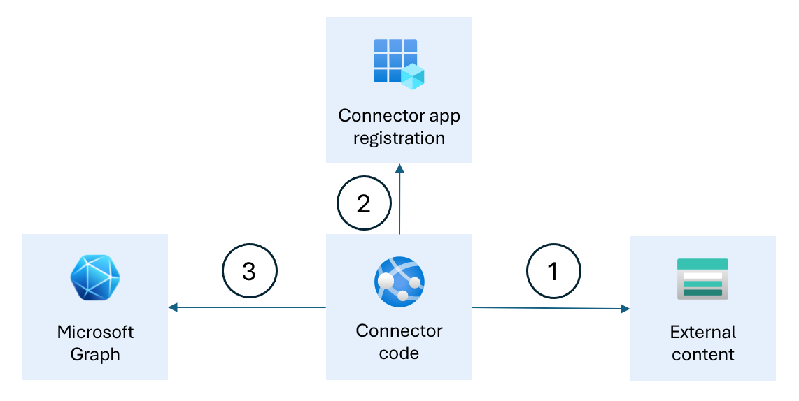

---
lab:
  title: 소개
  module: 'LAB 02: Integrate external content with Copilot for Microsoft 365 using Microsoft Graph connectors built with .NET'
---

# 소개

기술 자료 문서를 저장하는 외부 시스템이 있다고 가정해 보겠습니다. 이러한 문서에는 조직의 다양한 프로세스에 대한 정보가 포함되어 있습니다. Microsoft 365에서 관련 정보를 쉽게 찾고 검색하려고 합니다. 또한 Microsoft 365용 Copilot에서 이러한 기술 자료 문서의 정보를 응답에 포함하려고 합니다.

Microsoft 365 내에서 이 외부 정보를 노출하려면 사용자 지정 Microsoft Graph 커넥터를 빌드합니다. Microsoft Graph 커넥터는 외부 시스템(1)에 연결하여 콘텐츠를 검색하고, Microsoft Entra ID의 정보를 사용하여 Microsoft 365(2)로 인증하고, Microsoft Graph API(3)를 사용하여 Microsoft 365로 콘텐츠를 가져옵니다.

이 모듈에서는 Microsoft Graph 커넥터의 개념 및 조직에서 커넥터 사용을 고려해야 하는 이유를 알아봅니다. 로컬 markdown 파일을 Microsoft 365로 가져오는 Microsoft Graph 커넥터를 빌드합니다. 또한 적절한 할당된 권한이 있는 개인만 가져오는 외부 콘텐츠에 액세스할 수 있도록 하는 방법에 대해서도 알아봅니다. 마지막으로 Microsoft 365용 Copilot과 함께 사용할 수 있는 Microsoft Graph 커넥터를 최적화합니다.

## 필수 조건

- C#에 대한 기본 지식
- 인증에 대한 기본 지식
- [Microsoft 365 개발자 테넌트](https://developer.microsoft.com/microsoft-365/dev-program?ocid=MSlearn)에 대한 액세스 권한
- [.NET 8.0](https://dotnet.microsoft.com/download/dotnet/8.0)

시작 준비가 되면 [다음 연습을 계속 진행합니다...](./2-exercise-configure-connection-schema.md)