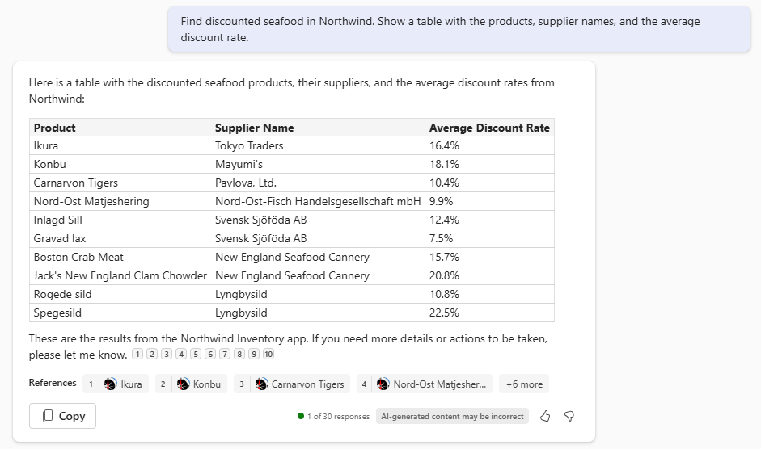

---
lab:
  title: 연습 2 - Copilot 플러그 인으로 샘플 실행
  module: 'LAB 03: Build your own message extension plugin with TypeScript (TS) for Microsoft Copilot'
---

# 연습 2 - Copilot 플러그 인으로 샘플 실행

이 연습에서는 Microsoft 365용 Microsoft Copilot 플러그 인으로 애플리케이션을 실행합니다. 다양한 프롬프트로 실험하고 여러 매개 변수를 사용하여 플러그인이 호출되는 방식을 관찰합니다.

> [!NOTE]  
> 다음 연습을 수행하려면 계정에 Microsoft 365용 Copilot에 대한 유효한 라이선스가 있어야 합니다.

## 작업 1 - Microsoft 365용 Microsoft Copilot에서 테스트(단일 매개 변수)

1. Microsoft Teams 내에서 **새 Teams 시도** 스위치를 전환하여 **새 Teams** 클라이언트 애플리케이션으로 이동합니다.

    > [!IMPORTANT]
    > Microsoft 365용 Microsoft Copilot은 **새 Teams** 환경에서만 작동합니다. 이 작업을 놓치지 마세요! **새 Teams**로 전환한 후 디버거를 다시 시작하면 디버거가 시작된 후 오류 메시지가 표시될 수 있습니다. 이는 알려진 문제입니다. 오류 대화 상자를 닫고 테스트를 계속하세요.

1. 왼쪽의 애플리케이션 레일에서 **Copilot** 앱을 선택합니다.

1. 작성 상자의 오른쪽에서 **플러그 인** 아이콘 1️⃣을 선택하고 **Northwind 인벤토리** 플러그 인 2️⃣을 사용하도록 설정합니다.

    

1. 최상의 결과 위해 각 프롬프트 또는 관련 프롬프트 집합 바로 앞에 있는 **새 채팅** 아이콘을 선택합니다.

    

1. 메시지 확장의 단일 매개 변수만 사용하는 다음 프롬프트를 시도합니다.

    - _Northwind 인벤토리의 차에 대한 정보를 찾습니다._

    - _Northwind에서 할인된 해산물을 찾습니다. 제품, 공급업체 이름, 평균 할인율 및 기간별 수익이 포함된 테이블을 표시합니다._

마지막으로 OneDrive에 업로드한 문서를 참조해야 합니다. 테스트하는 동안 Visual Studio Code에서 로그 메시지를 확인합니다. Copilot이 플러그 인을 호출하고 쿼리를 제출할 때 확인할 수 있어야 합니다. 예를 들어, **할인된 해산물 항목**을 요청한 후 Copilot이 `discountSearch` 명령을 사용하여 이 쿼리를 실행했습니다.


Northwind 데이터의 인용은 3가지 형식으로 표시될 수 있습니다. 단일 참조가 있는 경우 Copilot은 전체 카드를 표시할 수 있습니다.


다중 참조가 있는 경우 Copilot 옆에 작은 숫자가 표시될 수 있습니다. 이 숫자를 마우스로 가리키면 적응형 카드를 표시할 수 있습니다. 참조도 응답 아래에 나열됩니다.



이러한 적응형 카드를 사용하여 제품에 대한 조치를 취하세요. 이는 Copilot의 이전 응답에 영향을 주지 않습니다.

자신의 프롬프트를 자유롭게 만들 수 있습니다. Copilot이 필요한 정보를 플러그 인에 쿼리할 수 있는 경우에만 작동한다는 것을 알 수 있습니다. 이는 사용자가 실행할 프롬프트 종류를 예측하고 각 프롬프트에 해당하는 유형의 쿼리를 제공해야 하는 필요성을 강조합니다. 매개 변수가 여러 개 있으면 이 기능을 더욱 강력하게 만들 수 있습니다.

## 작업 2 - Microsoft 365용 Microsoft Copilot에서 테스트(다중 매개 변수)

이 연습에서는 샘플 플러그 인에서 다중 매개 변수 기능을 연습하는 몇 가지 프롬프트를 시도합니다. 이러한 프롬프트는 **앱 매니페스트**에 정의된 대로 **이름**, **범주**, **인벤토리 상태**, **공급업체 도시** 및 **재고 수준**으로 검색할 수 있는 데이터를 요청합니다.

예를 들어 **_재고가 100개 이상인 Northwind 음료 찾기_** 를 요청해 보세요. 응답을 생성하려면 Copilot이 제품을 식별해야 합니다.

- 여기서 범주는 **음료**입니다.
  
  _및_

- 인벤토리 상태가 **재고 있음**인 경우.

  _및_

- **재고 수준**이 **100개 이상**인 경우.

로그 파일을 보면 Copilot이 이 요구 사항을 이해하고 첫 번째 메시지 확장 명령에서 매개 변수 중 3개만 입력할 수 있음을 알 수 있습니다.


플러그 인 코드는 세 가지 필터를 모두 적용하여 단 4개의 제품 결과 집합을 제공합니다. Copilot은 결과 적응형 카드에 대한 정보를 사용하여 다음과 유사한 결과를 렌더링합니다.


이 프롬프트를 통해 Copilot는 OneDrive 파일을 조회하여 각 공급업체의 계약에 대한 지불 조건을 찾을 수도 있습니다. 이 경우 일부 참조에는 **Northwind 인벤토리** 아이콘이 없지만 **Word** 아이콘이 있음을 알 수 있습니다.


다음은 몇 가지 추가 프롬프트입니다.

- _재고가 낮은 Northwind 유제품을 찾습니다. 제품, 공급 업체, 재고 단위 및 주문 테이블을 표시합니다._

- _우리는 Tofu에 대한 부분 주문을 받았습니다. Northwind에서 공급업체를 찾아 인벤토리를 요약하고 MOQ 정책에 따라 부분 주문 전송을 중단해야 한다는 것을 알리는 이메일 초안을 작성합니다._

- _Northwind는 런던의 Microsoft Community Days에 부스를 개설합니다. 지역 공급업체와 제품을 찾고 부스와 제품을 홍보하기 위해 LinkedIn 게시물을 작성합니다. 제품이 얼마나 맛있는지 강조하고 사람들이 우리 부스를 방문하도록 유도합니다._

- _런던의 Northwind에서 소셜 미디어로 인해 수요가 높아져 재고가 줄어든 음료는 어떤 제품인가요? 제품 세부 정보를 참조하여 재고를 업데이트합니다._

가장 적합한 프롬프트는 무엇인가요? 사용자 고유의 프롬프트를 만들고 로그 메시지를 관찰하여 Copilot가 플러그 인에 액세스하는 방법을 확인합니다.

### 문제 해결 팁

플러그 인을 테스트하는 동안 문제가 발생하면 **개발자 모드**를 사용하도록 설정할 수 있습니다. 개발자 모드는 프롬프트에 응답하기 위해 Copilot 오케스트레이터가 선택한 플러그 인에 대한 정보를 제공합니다. 또한 플러그 인에서 사용 가능한 함수와 API 호출의 상태 코드도 보여 줍니다.

개발자 모드를 사용하도록 설정하려면 다음을 Copilot에 입력합니다.

```console
-developer on
```

프롬프트를 실행하면 개발자 모드 다음과 유사한 결과를 출력합니다. 


여기서 볼 수 있듯이 Copilot에서 생성된 응답 아래에는 백그라운드에서 발생한 일에 대한 통찰력 있는 정보를 제공하는 테이블이 있습니다.

- **Enabled plugins** 아래에서 Copilot이 Northwind 인벤토리 플러그 인을 사용하도록 설정되어 있음을 확인할 수 있습니다.

- **Matched functions**아래에서 Copilot이 Northwind 인벤토리 플러그 인으로 세 가지 함수 `inventorySearch`, `discountSearch`및 `companySearch`을 제공하도록 결정한 것을 확인할 수 있습니다.

- **Selected functions for execution** 아래에서 Copilot가 프롬프트에 응답할 `inventorySearch` 함수를 선택한 것을 볼 수 있습니다.

- **Function execution details** 아래에서 플러그 인이 Copilot 엔진에 반환한 HTTP 응답과 같은 실행에 대한 자세한 정보를 볼 수 있습니다.

## 작업 확인

이 연습의 작업을 완료한 후에는 Microsoft 365용 코필로트에서 **Northwind 인벤토리** 플러그 인을 사용할 수 있어야 합니다. 

이 연습이 완료되면 플러그 인 기능을 확장하고 더 많은 작업을 수행할 수 있도록 메시징 확장에 새 명령을 추가할 준비가 된 것입니다. 

[다음 연습을 계속 진행합니다.](./5-exercise-3-add-new-command.md)
