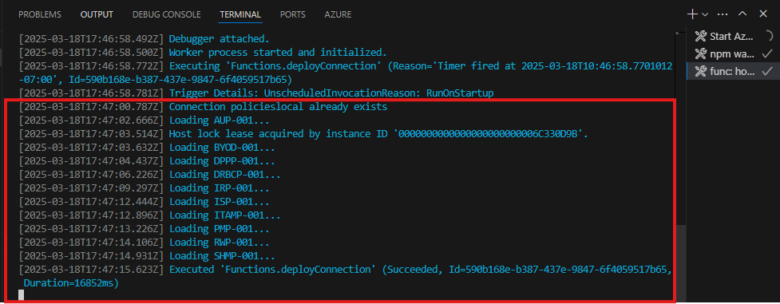

---
lab:
  title: 연습 1 - Graph 커넥터에 대한 외부 연결 만들기
  module: 'LAB 04: Add custom knowledge to declarative agents using Microsoft Graph connectors and Visual Studio Code'
---

# 연습 1 - Graph 커넥터에 대한 외부 연결 만들기

지식이 있는 선언적 에이전트를 확장하면 대규모 언어 모델의 일부가 아닌 추가 정보에 액세스할 수 있습니다. Graph 커넥터를 사용하여 Microsoft 365에 외부 데이터를 수집할 수 있으며, Microsoft 365 Copilot을 비롯한 다양한 사용자 환경에서 사용할 수 있습니다. Copilot 에이전트의 지식 설정을 구성할 때 그래프 커넥터로 만든 외부 연결과 통합할 수 있습니다.

### 연습 기간

- **예상 완료 시간**: 10분

## 작업 1 - 샘플 프로젝트 다운로드 및 리소스에 연결

Graph 커넥터와 Copilot 에이전트를 통합하는 경우 커넥터가 만든 외부 연결의 ID를 지정해야 합니다. 일반적으로 Graph 커넥터는 Copilot 에이전트와 별도로 배포합니다. 이 연습을 완료하려면 이후 단계에서 참조하는 기존 Graph 커넥터를 배포합니다.

Graph 커넥터 샘플 프로젝트를 다운로드하여 시작합니다.

1. 웹 브라우저에서 [https://aka.ms/learn-gc-ts-policies](https://aka.ms/learn-gc-ts-policies)으로 이동합니다. 샘플 프로젝트와 함께 ZIP 파일을 다운로드하라는 메시지가 표시됩니다.
1. ZIP 파일을 컴퓨터에 저장합니다.
    1. **문서**에 새 폴더를 만듭니다.
    1. 다운로드한 ZIP 파일의 내용을 방금 만든 폴더에 압축을 풉니다.
    1. Visual Studio Code에서 폴더를 엽니다.

Visual Studio Code:

1. 파일 메뉴에서 **폴더 열기...** 옵션을 선택합니다.
1. 방금 압축을 푼 프로젝트 폴더를 **문서 폴더**에 엽니다.
1. **작업 표시줄**(사이드바)에서 **Teams 도구 키트** 확장을 엽니다.
1. **계정** 창에서 **Microsoft 365 테넌트**에 연결되어 있는지 확인합니다.
1. **계정** 창에서 **Azure 구독**에 연결되어 있는지 확인합니다.

    

> [!NOTE]
> 정식 Microsoft 365 Copilot 라이선스가 아닌 경우 "Copilot 액세스 사용 안 함"이라는 메시지가 표시될 수 있습니다. Microsoft 365 Copilot Chat에서 에이전트를 완전히 테스트하지 못할 수도 있지만 연습은 계속 완료할 수 있습니다.

## 작업 2 - 프로젝트 실행 및 Microsoft 365에 대한 연결 만들기

1. <kbd>F5</kbd> 키를 눌러 프로젝트를 시작합니다. Teams 도구 키트는 Graph 커넥터가 Microsoft 365 테넌트와 통신할 수 있도록 테넌트에 새 Microsoft Entra 앱 등록을 만듭니다. Teams 도구 키트는 Graph 커넥터를 호스팅하는 타이머 트리거 Azure Function도 시작합니다.

> [!IMPORTANT]
> 이 단계를 완료하는 데 최대 10분 이상이 걸릴 수 있으며 연습을 완료할 때까지 닫지 마세요.

1. Graph 커넥터를 실행하려면 Entra 앱에 필요한 권한에 동의해야 합니다. 동의를 부여하려면, **func: host start** 작업과 연결된 **터미널** 창의 지침을 사용합니다.

    

1. 웹 브라우저에서 동의 URL을 엽니다. Microsoft 365 테넌트에 속한 회사 계정으로 로그인합니다. **관리자 동의 부여** 버튼을 사용하여 앱에 필요한 권한을 부여합니다.

    

1. 필요한 권한에 대한 동의를 부여하면 Graph 커넥터가 계속됩니다. **터미널** 창에서 Graph 커넥터의 출력을 확인합니다. Graph 커넥터는 외부 연결을 만들고 스키마를 프로비전하며 샘플 콘텐츠를 Microsoft 365 테넌트에 수집합니다.
1. 커넥터를 실행하는 데 5~10분 정도 걸립니다. 작업이 완료되면, 디버그 도구 모음에서 **중지** 버튼을 눌러 디버깅을 중지합니다.

    
