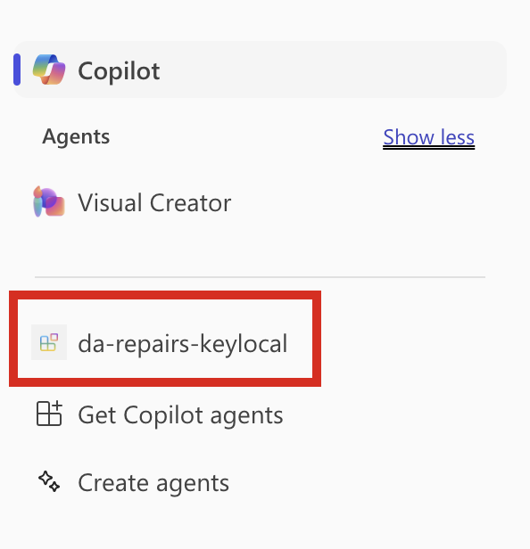

---
lab:
  title: 연습 2 - Microsoft 365 Copilot Chat에서 선언적 에이전트 테스트
  module: 'LAB 05: Authenticate your API plugin for declarative agents with secured APIs'
---

# 연습 2 - Microsoft 365 Copilot Chat에서 선언적 에이전트 테스트

이 연습에서는 선언적 에이전트를 Microsoft 365에 테스트 및 배포하고 Microsoft 365 Copilot Chat을 사용하여 테스트합니다.

### 연습 기간

- **예상 완료 시간**: 10분

## 작업 1 - Microsoft 365 Copilot Chat에서 API 플러그 인을 사용하여 선언적 에이전트 테스트

마지막 단계는 Microsoft 365 Copilot에서 API 플러그 인을 사용하여 선언적 에이전트를 테스트하는 것입니다.

Visual Studio Code:

1. 작업 표시줄에서 **Teams Toolkit** 확장을 엽니다.
1. **Teams Toolkit** 확장 패널의 **Accounts** 섹션에서 자신의 Microsoft 365 테넌트에 로그인한 상태인지 확인합니다.

  

1. 작업 표시줄에서 실행 및 디버그 보기로 전환합니다.
1. 구성 목록에서 **Copilot에서 디버그(Edge)** 을 선택하고 재생 단추를 눌러 디버깅을 시작합니다.

  

  Visual Studio Code는 Microsoft 365 Copilot Chat을 사용하여 새 웹 브라우저를 엽니다. 로그인하라는 메시지가 표시되면 Microsoft 365 계정을 사용하여 로그인합니다.

웹 브라우저에서:

1. 가로 패널에서 **da-repairs-keylocal** 에이전트를 선택합니다.

  

1. 프롬프트 텍스트 상자에 `What repairs are assigned to Karin?` 입력 후 프롬프트를 제출합니다.
1. **Always allow** 단추를 사용하여 API 플러그 인에 데이터를 보낼 용의가 있음을 확인합니다.

  

1. 에이전트가 응답할 때까지 기다립니다.

  

테스트를 완료하면 Visual Studio Code에서 디버깅 세션을 중지합니다.