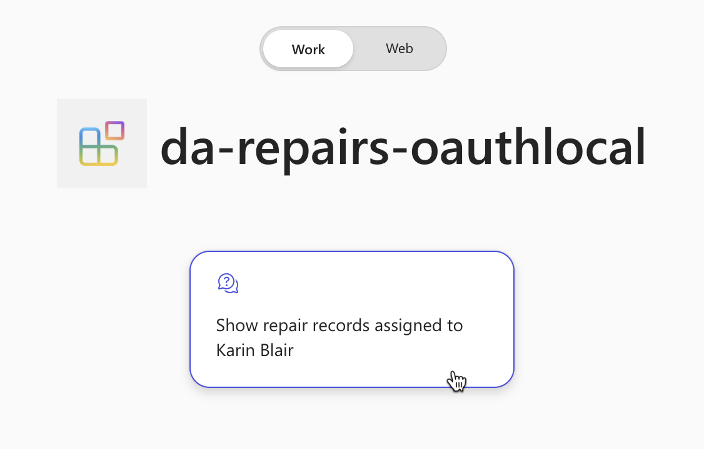

---
lab:
  title: 연습 4 - Microsoft 365 Copilot Chat에서 선언적 에이전트 테스트
  module: 'LAB 05: Authenticate your API plugin for declarative agents with secured APIs'
---

# 연습 34 - Microsoft 365 Copilot에서 선언적 에이전트 테스트

이 연습에서는 선언적 에이전트를 Microsoft 365에 테스트 및 배포하고 Microsoft 365 Copilot Chat을 사용하여 테스트합니다.

### 연습 기간

- **예상 완료 시간**: 5분

## 작업 1 - Microsoft 365 Copilot에서 API 플러그 인을 사용하여 선언적 에이전트 테스트

마지막 단계는 Microsoft 365 Copilot에서 API 플러그 인을 사용하여 선언적 에이전트를 테스트하는 것입니다.

Visual Studio Code:

1. 작업 표시줄에서 **Teams Toolkit** 확장을 엽니다.
1. **Teams Toolkit** 확장 패널의 **Accounts** 섹션에서 자신의 Microsoft 365 테넌트에 로그인한 상태인지 확인합니다.

    

1. 작업 표시줄에서 **Run and Debug** 보기로 전환합니다.
1. 구성 목록에서 **Copilot에서 디버그(Edge)** 을 선택하고 재생 단추를 눌러 디버깅을 시작합니다.

    

    Visual Studio Code는 Microsoft 365 Copilot이 있는 새 웹 브라우저를 엽니다. 로그인하라는 메시지가 표시되면 Microsoft 365 계정을 사용하여 로그인합니다.

웹 브라우저에서:

1. 측면 패널에서 **da-repairs-oauthlocal** 에이전트를 선택합니다.

    

1. 프롬프트 텍스트 상자에 `Show repair records assigned to Karin Blair` 입력 후 프롬프트를 제출합니다.

    > [!TIP]
    > 프롬프트를 입력하는 대신 대화 시작 요소 중에서 선택할 수 있습니다.

    

1. **Always allow** 단추를 사용하여 API 플러그 인에 데이터를 보낼 용의가 있음을 확인합니다.

    

1. 메시지가 표시되면 Microsoft 365 테넌트에 로그인하는 데 사용한 것과 동일한 계정을 사용하여 API에 로그인함으로써 계속합니다. **Sign in to da-repairs-oauthlocal**을 선택하면 됩니다.

    

1. 에이전트가 응답할 때까지 기다립니다.

    

API가 로컬 컴퓨터에서 실행 중이므로 익명으로 액세스할 수 있지만, Microsoft 365 Copilot은 인증된 API를 API 사양에 지정된 대로 호출합니다. **repairs** 함수에 중단점을 설정하고 선언적 에이전트에 다른 프롬프트를 제출하여 요청에 액세스 토큰이 포함되어 있는지 확인할 수 있습니다. 코드가 중단점에 도달하면 req.headers 컬렉션을 확장하고 JWT(SON Web Token)가 포함된 인증 헤더를 찾습니다.

테스트를 완료하면 Visual Studio Code에서 디버깅 세션을 중지합니다.
